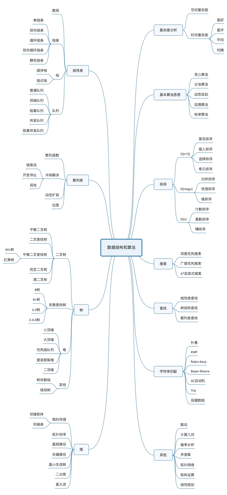
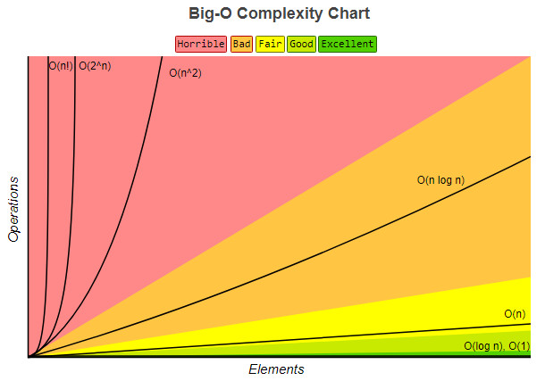

# 数据结构与算法思维导图



# 复杂度分析

## 事后统计法的局限性

- 测试结果非常依赖测试环境
- 测试结果受数据规模的影响很大

## 大 O 复杂度表示法

$$
\mathrm{T}(\mathrm{n})=\mathrm{O}(\mathrm{f}(\mathrm{n}))
$$

- `n` 表示数据规模的大小
- `f(n)` 表示每行代码执行的次数总和
- `T(n)` 表示代码执行的时间
-  `O` 表示代码的执行时间 `T(n)`  与  `f(n)`  表达式成正比

大 O 时间复杂度实际上并不具体表示代码真正的执行时间，而是表示代码执行时间**随数据规模增长的变化趋势**。

### 时间复杂度分析

时间复杂度的全称是渐进时间复杂度，表示算法的执行时间与数据规模之间的增长关系。

大 O  分析法通常会忽略掉公式中的常量、低阶、系数，只需要记录一个最大阶的量级就可以了。

常用分析方法：

- 只关注循环执行次数最多的一段代码
- 加法法则：总的时间复杂度就等于量级最大的那段代码的时间复杂度。
- 乘法法则：嵌套代码的复杂度等于嵌套内外代码复杂度的乘积

常见的复杂度量级：

- **多项式量级：**
  - 常量阶： `O(1)`
  - 对数阶：`O(logn)`
  - 线性阶：`O(n)`
  - 线性对数阶：`nO(logn)`
  - 平方阶：`O(n^2)`
  - 立方阶：`O(n^3)`
  - K次方阶：`O(n^k)`

- **非多项式量级：**
  - 指数阶：`O(2^n)`
  - 阶乘阶： `O(n!)`

非多项式时间复杂度的算法其实是非常低效的算法。

### 空间复杂度分析

空间复杂度全称就是渐进空间复杂度，表示算法的额外存储空间与数据规模之间的增长关系。

### 渐进复杂度小结

渐进复杂度，包括时间复杂度和空间复杂度，用来分析算法执行效率与数据规模之间的增长关系。



### 四种情况下时间复杂度分析

- 最好情况时间复杂度：在最理想的情况下，执行这段代码的时间复杂度
- 最坏情况时间复杂度：最糟糕的情况下，执行这段代码的时间复杂度
- 平均情况时间复杂度：用代码在所有情况下执行的次数的加权平均值表示。也叫加权平均时间复杂度或者期望时间复杂度
- 均摊时间复杂度：在代码执行的所有复杂度情况中绝大部分是低级别的复杂度，个别情况是高级别复杂度且发生具有时序关系时，可以将个别高级别复杂度均摊到低级别复杂度上，基本上均摊结果就等于低级别复杂度

分析下面的代码：

```
// n 表示数组 array 的长度
function find(array, n, x) {
  let i = 0;
  let pos = -1;
  for (; i < n; ++i) {
    if (array[i] == x) {
      pos = i; 
      break;
    }
  }
  return pos;
}
```

- 最好情况时间复杂度：如果数组中第一个值就等于 `x`，那么时间复杂度为 `O(1)`
- 最坏情况时间复杂度：如果数组中不存在变量 `x`，那我们就需要把整个数组都遍历一遍，时间复杂度就成了 `O(n)`
- 平均情况时间复杂度：


要查找的变量 `x` 在数组中的位置，有 `n+1` 种情况：在数组的 `0～n-1` 位置中和不在数组中。我们把每种情况下，查找需要遍历的元素个数累加起来，然后再除以 `n+1`，就可以得到需要遍历的元素个数的平均值，即：
$$
\frac{1+2+3+\cdots+n+n}{n+1}=\frac{n(n+3)}{2(n+1)}
$$
省略掉系数、低阶、常量，得到的平均时间复杂度就是 `O(n)`。

要查找的变量 `x`，要么在数组里，要么就不在数组里，假设在数组中与不在数组中的概率都为 `1/2`，要查找的数据出现在 `0～n-1` 这 `n` 个位置的概率也是一样的，为 `1/n`。要查找的数据出现在 `0～n-1` 中任意位置的概率就是 `1/2n`。

如果把每种情况发生的概率也考虑进去，那平均时间复杂度的计算过程：
$$
\begin{aligned}
& 1 \times \frac{1}{2 \mathrm{n}}+2 \times \frac{1}{2 \mathrm{n}}+3 \times \frac{1}{2 \mathrm{n}}+\cdots+\mathrm{n} \times \frac{1}{2 \mathrm{n}}+\mathrm{n} \times \frac{1}{2} \\
=& \frac{3 \mathrm{n}+1}{4}
\end{aligned}
$$
用大 O 表示法来表示，去掉系数和常量，这段代码的加权平均时间复杂度仍然是 `O(n)`。


