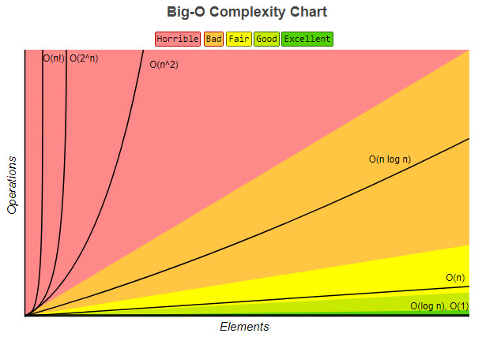

.. contents::目录

数据结构与算法思维导图
======================

|image1|

复杂度分析
==========

事后统计法的局限性
------------------

-  测试结果非常依赖测试环境
-  测试结果受数据规模的影响很大

大 O 复杂度表示法
-----------------

.. math::

   \mathrm{T}(\mathrm{n})=\mathrm{O}(\mathrm{f}(\mathrm{n}))

-  ``n`` 表示数据规模的大小
-  ``f(n)`` 表示每行代码执行的次数总和
-  ``T(n)`` 表示代码执行的时间
-  ``O`` 表示代码的执行时间 ``T(n)`` 与 ``f(n)`` 表达式成正比

大 O
时间复杂度实际上并不具体表示代码真正的执行时间，而是表示代码执行时间\ **随数据规模增长的变化趋势**\ 。

时间复杂度分析
~~~~~~~~~~~~~~

时间复杂度的全称是渐进时间复杂度，表示算法的执行时间与数据规模之间的增长关系。

大 O
分析法通常会忽略掉公式中的常量、低阶、系数，只需要记录一个最大阶的量级就可以了。

常用分析方法：

-  只关注循环执行次数最多的一段代码
-  加法法则：总的时间复杂度就等于量级最大的那段代码的时间复杂度。
-  乘法法则：嵌套代码的复杂度等于嵌套内外代码复杂度的乘积

常见的复杂度量级：

-  **多项式量级：**

   -  常量阶： ``O(1)``
   -  对数阶：\ ``O(logn)``
   -  线性阶：\ ``O(n)``
   -  线性对数阶：\ ``nO(logn)``
   -  平方阶：\ ``O(n^2)``
   -  立方阶：\ ``O(n^3)``
   -  K次方阶：\ ``O(n^k)``

-  **非多项式量级：**

   -  指数阶：\ ``O(2^n)``
   -  阶乘阶： ``O(n!)``

非多项式时间复杂度的算法其实是非常低效的算法。

空间复杂度分析
~~~~~~~~~~~~~~

空间复杂度全称就是渐进空间复杂度，表示算法的额外存储空间与数据规模之间的增长关系。

渐进复杂度小结
~~~~~~~~~~~~~~

渐进复杂度，包括时间复杂度和空间复杂度，用来分析算法执行效率与数据规模之间的增长关系。

|image2|

.. |image1| image:: ./img/sketch.jpg

