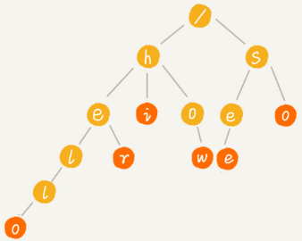
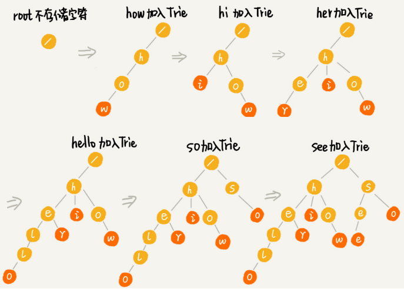

# Trie 树

Trie 树也叫“字典树”，是一种专门处理字符串匹配的树形结构，用来解决在一组字符串集合中快速查找某个字符串的问题。

Trie 树特有的优点，决定它特别适合做搜索引擎的搜索关键词提示功能：在搜索引擎的搜索框中，输入要搜索的文字的某一部分的时候，搜索引擎就会自动弹出下拉框，里面是各种关键词提示。可以直接从下拉框中选择你要搜索的东西，而不用把所有内容都输入进去，一定程度上节省了我们的搜索时间。

假设有 6 个字符串分别是：`how，hi，her，hello，so，see`，组织成 Trie 树的结构，之后每次查找，都是在 Trie 树中进行匹配查找。

Trie 树的本质，就是利用字符串之间的公共前缀，将重复的前缀合并在一起。最后构造出来的就是下面这个图中的样子：



其中，根节点不包含任何信息。每个节点表示一个字符串中的字符，从根节点到红色节点的一条路径表示一个字符串（红色节点并不都是叶子节点）。

Trie 树构造的过程：



在 Trie 树中查找字符串的时候，比如查找字符串 `her`，先将要查找的字符串分割成单个的字符 `h，e，r`然后从 Trie 树的根节点开始匹配。下图中绿色的路径就是在 Trie 树中匹配的路径。


要查找字符串 `he`，先将要查找的字符串分割成单个的字符 `h，e`。然后从根节点开始沿着某条路径来匹配，下图绿色的路径就是 `he` 匹配的路径，但路径最后一个节点 `e` 并不是红色的（“he”是某个字符串的前缀子串），说明未匹配。


## 实现Trie 树

Trie 树主要有两个操作：

- 将字符串插入到 Trie 树中

- 在 Trie 树中查询一个字符串

Trie 树是一个多叉树，经典的存储方式是通过一个下标与字符一一映射的数组，来存储子节点的指针。

```
template<int SIZE>
class TrieNode
{
public:
	TrieNode() : terminable_size(0), node_size(0)
	{
		for (int i = 0; i < SIZE; ++i)
			children[i] = nullptr;
	}

	~TrieNode()
	{
		for (int i = 0; i < SIZE; ++i)
		{
			delete children[i];
			children[i] = nullptr;
		}
	}

public:
	int terminable_size;
	int node_size;
	TrieNode* children[SIZE];
};


template<int SIZE, class T>
class Trie
{
public:
	using Node = TrieNode<SIZE>;
	using pNode = TrieNode<SIZE>*;

	Trie() : root(new Node) {}

	template<class Iterator>
	void insert(Iterator beg, Iterator end);
	void insert(const char *str);

	template<class Iterator>
	bool find(Iterator beg, Iterator end);
	bool find(const char *str);

	template<class Iterator>
	bool down_node_alone(Iterator beg);

	template<class Iterator>
	bool erase(Iterator beg, Iterator end);
	bool erase(const char *str);

	int size_all(pNode);
	int size_none_redundant(pNode);

public:
	pNode root;
private:
	T index;
};

template<int SIZE, class T>
template<class Iterator>
void Trie<SIZE, T>::insert(Iterator beg, Iterator end)
{
	pNode cur = root;
	pNode pre;
	for (; beg != end; ++beg)
	{
		if (cur->children[index[*beg]] == nullptr)
		{
			cur->children[index[*beg]] = new(Node);
			++cur->node_size;
		}
		pre = cur;
		cur = cur->children[index[*beg]];
	}
	++pre->terminable_size;
}


template<int SIZE, class T>
void Trie<SIZE, T>::insert(const char *str)
{
	return insert(str, str + strlen(str));
}

template<int SIZE, class T>
template<class Iterator>
bool Trie<SIZE, T>::find(Iterator beg, Iterator end)
{
	pNode cur = root;
	pNode pre;
	for (; beg != end; ++beg)
	{
		if (cur->children[index[*beg]]  == nullptr)
		{
			return false;
		}
		pre = cur;
		cur = cur->children[index[*beg]];
	}
	if (pre->terminable_size > 0)
		return true;
	return false;
}

template<int SIZE, class T>
bool Trie<SIZE, T>::find(const char *str)
{
	return find(str, str + strlen(str));
}

template<int SIZE, class T>
template<class Iterator>
bool Trie<SIZE, T>::down_node_alone(Iterator beg)
{
	pNode cur = root;
	int terminableSum = 0;
	while (cur->node_size != 0)
	{
		terminableSum += cur->terminable_size;
		if (cur->node_size > 1)
			return false;
		else //@ == 1
		{
			for (int i = 0; i < SIZE; ++i)
			{
				if (cur->children[i])
					cur = cur->children[i];
			}
		}
	}
	if (terminableSum == 1)
		return true;
	return false;
}

template<int SIZE, class T>
template<class Iterator>
bool Trie<SIZE, T>::erase(Iterator beg, Iterator end)
{
	if (find(beg, end))
	{
		pNode cur = root;
		pNode pre;
		for (; beg != end; ++beg)
		{
			if (down_node_alone(cur))
			{
				delete cur;
				return true;
			}
			pre = cur;
			cur = cur->children[index[*beg]];
		}
		if (pre->terminable_size > 0)
			--pre->terminable_size;
		return true;
	}
	return false;
}

template<int SIZE, class T>
bool Trie<SIZE, T>::erase(const char *str)
{
	return erase(str, str + strlen(str));
}

template<int SIZE, class T>
int Trie<SIZE, T>::size_all(pNode ptr)
{
	if (ptr == nullptr)
		return 0;
	int rev = ptr->terminable_size;
	for (int i = 0; i < SIZE; ++i)
		rev += size_all(ptr->children[i]);
	return rev;
}

template<int SIZE, class T>
int Trie<SIZE, T>::size_none_redundant(pNode ptr)
{
	if (ptr == nullptr)
		return 0;
	int rev = 0;
	if (ptr->terminable_size > 0)
		rev = 1;
	if (ptr->node_size != 0)
	{
		for (int i = 0; i < SIZE; ++i)
			rev += size_none_redundant(ptr->children[i]);
	}
	return rev;
}

template<int SIZE>
class Index
{
public:
	int operator[](char vchar)
	{
		return vchar % SIZE;
	}
};

int main()
{
	Trie<26, Index<26>> t;

	t.insert("hello");
	t.insert("hello");
	t.insert("h");
	t.insert("h");
	t.insert("he");
	t.insert("hel");

	cout << "size all:" << t.size_all(t.root) << endl;
	cout << "size all:" << t.size_none_redundant(t.root) << endl;

	t.erase("h");
	t.erase("h");

	cout << "size all:" << t.size_all(t.root) << endl;
	cout << "size all:" << t.size_none_redundant(t.root) << endl;

	return 0;
}
```

## Trie树的适用场景

关于字符串的匹配问题，对于精确匹配查找，这种问题更适合用散列表或者红黑树来解决。

对于查找前缀匹配的字符串，使用Trie树效率会更高。例如自动输入补全，比如输入法自动补全功能、IDE 代码编辑器自动补全功能、浏览器网址输入的自动补全功能等等。


