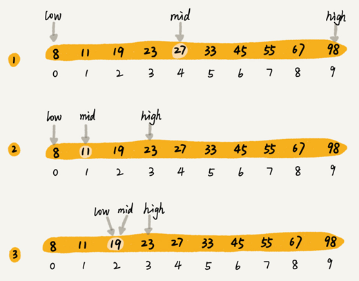

.. toctree::
   :maxdepth: 2
   :glob:

二分查找
========

二分查找（Binary Search）算法，也叫折半查找算法。

二分查找针对的是一个有序的数据集合，查找思想有点类似分治思想。每次都通过跟区间的中间元素对比，将待查找的区间缩小为之前的一半，直到找到要查找的元素，或者区间被缩小为
0。

二分查找的时间复杂度为 ``O(logn)``\ 。

例如想在下面的序列中查找19：

|image1|

二分查找的实现
--------------

最简单的情况就是有序数组中不存在重复元素：

::

   int search(vector<int> nums, int target)
   {
       int left = 0, right = nums.size() - 1;
       while (left <= right)
       {
           int mid = left + ((right - left) >> 1);
           if (nums[mid] == target)
               return mid;
           else if (nums[mid] > target)
               right = mid - 1;
           else
               left = mid + 1;
       }
       return -1;
   }

-  二分区间：\ ``[0,size)``
-  向左查找：\ ``right=mid-1``\ ；向右查找：\ ``left=mid+1``
-  循环结束条件是：\ ``left>right`` 即 ``left=right+1``

递归实现：

::

   int search_recursive(vector<int> arr, int target)
   {
       int left = 0, right = arr.size() - 1;
       while (left <= right)
       {
           int mid = left + ((right - left) >> 1);
           if (arr[mid] == target)
               return mid;
           else if (arr[mid] > target)
               right = mid - 1;
           else
               left = mid + 1;
       }
       return -1;
   }

二分查找应用场景的局限性
------------------------

二分查找依赖数组
~~~~~~~~~~~~~~~~

二分查找只能用在数据是通过顺序表来存储的数据结构上。如果你的数据是通过其他数据结构存储的，则无法应用二分查找。

二分查找算法需要按照下标随机访问元素，所以不能用链表随机访问，因为链表的随机访问时间复杂度是
``O(n)``\ 。

二分查找要求数据必须是有序的
~~~~~~~~~~~~~~~~~~~~~~~~~~~~

数据没有序，进行一次排序，多次二分查找。这样排序的成本可被均摊，二分查找的边际成本就会比较低。

但如果数据集合有频繁的插入和删除操作，要想用二分查找，要么每次插入、删除操作之后保证数据仍然有序，要么在每次二分查找之前都先进行排序。针对这种动态数据集合，无论哪种方法，维护有序的成本都是很高的。

所以，二分查找只能用在插入、删除操作不频繁，一次排序多次查找的场景中。

数据量太小二分查找性能提升不大
~~~~~~~~~~~~~~~~~~~~~~~~~~~~~~

如果数据之间的比较操作非常耗时，比较次数的减少会大大提高性能，这个时候二分查找就比顺序遍历更有优势。

数据量太大不适合二分查找
~~~~~~~~~~~~~~~~~~~~~~~~

二分查找的底层需要依赖数组这种数据结构，而数组为了支持随机访问的特性，要求内存空间连续，对内存的要求比较苛刻。比如有
1GB 大小的数据，用数组来存储，就需要 1GB 的连续内存空间。

“连续”意味着即便有 2GB 的内存空间剩余，但是如果这剩余的 2GB
内存空间都是零散的，没有连续的 1GB 大小的内存空间，那就无法申请一个 1GB
大小的数组。

二分查找的四种变体
------------------

查找第一个值等于给定值的元素
~~~~~~~~~~~~~~~~~~~~~~~~~~~~

如果有序数据集合中存在重复的数据，要找到第一个值等于给定值的数据。

比如下面这样一个有序数组，其中，\ ``a[5]，a[6]，a[7]`` 的值都等于
8，是重复的数据。我们希望查找第一个等于 8 的数据，也就是下标是 5
的元素。

|image2|

::

   int search_first_equal(vector<int> arr, int target)
   {
       int left = 0, right = arr.size() - 1;
       while (left <= right)
       {
           int mid = left + ((right - left) >> 1);
           if (arr[mid] > target)
               right = mid - 1;
           else if (arr[mid] < target)
               left = mid + 1;
           else
           {
               if (mid == 0 || arr[mid - 1] != target)
                   return mid;
               else
                   right = mid - 1;
           }
       }
       return -1;
   }

查找最后一个值等于给定值的元素
~~~~~~~~~~~~~~~~~~~~~~~~~~~~~~

::

   int search_last_equal(vector<int> arr, int target)
   {
       int left = 0, right = arr.size() - 1;
       while (left <= right)
       {
           int mid = left + ((right - left) >> 1);
           if (arr[mid] > target)
               right = mid - 1;
           else if (arr[mid] < target)
               left = mid + 1;
           else
           {
               if (mid == arr.size() - 1 || arr[mid + 1] != target)
                   return mid;
               else
                   left = mid + 1;
           }
       }
       return -1;
   }

查找第一个大于等于给定值的元素
~~~~~~~~~~~~~~~~~~~~~~~~~~~~~~

::

   int search_first_not_less(vector<int> arr, int target)
   {
       int left = 0, right = arr.size() - 1;
       while (left <= right)
       {
           int mid = left + ((right - left) >> 1);
           if (arr[mid] > target)
               right = mid - 1;
           else
               left = mid + 1;
       }
       if (left < arr.size() && arr[left] >= target)
           return left;
       else
           return -1;
   }

查找最后一个小于等于给定值的元素
~~~~~~~~~~~~~~~~~~~~~~~~~~~~~~~~

::

   int search_last_not_greater(vector<int> arr, int target)
   {
       int left = 0, right = arr.size() - 1;
       while (left <= right)
       {
           int mid = left + ((right - left) >> 1);
           if (arr[mid] <= target)
               left = mid + 1;
           else
               right = mid - 1;
       }
       if (right >= 0 && arr[right] <= target)
           return right;
       else
           return -1;
   }

.. |image2| image:: ./img/binary_search_2.png
