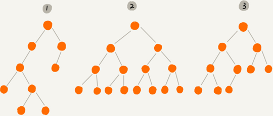
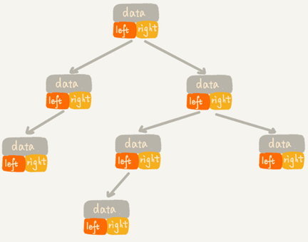
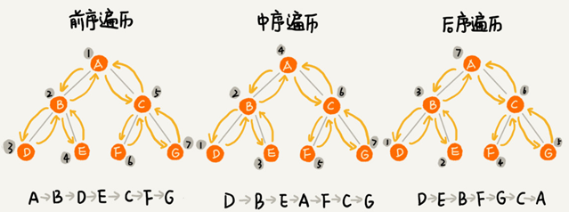
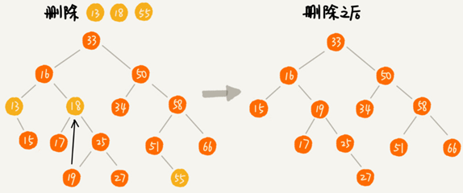

# 二叉树基础

## 树（Tree）
树是一种非线性表结构，比线性表的数据结构要复杂得多，树的种类：

- 树，二叉树
- 二叉查找树
- 平衡二叉查找树、红黑树
- 递归树

**树的特征：**

树这种数据结构里面每个元素叫作“节点”；用来连线相邻节点之间的关系叫作“父子关系”。


比如下面这幅图，A 节点就是 B 节点的**父节点**，B 节点是 A 节点的**子节点**。B、C、D 这三个节点的父节点是同一个节点，所以它们之间互称为**兄弟节点**。没有父节点的节点叫**根节点**，也就是图中的节点 E。没有子节点的节点叫作**叶子节点**或者**叶节点**，比如图中的 G、H、I、J、K、L 都是叶子节点。


**高度**（Height）、**深度**（Depth）、**层**（Level）的定义：

- 节点的高度=节点到叶子节点的最长路径(边数)
- 节点的深度=根节点到这个节点所经历的边的个数
- 节点的层数=节点的深度+1
- 树的高度=根节点的高度


- “高度”是从下往上度量，从最底层开始计数计数的起点是 0。

- “深度”是从上往下度量，从根结点开始度量计数起点也是 0。

- “层数”跟深度的计算类似，不过计数起点是 1。

## 二叉树（Binary Tree）

二叉树的每个节点最多有两个子节点，分别是左子节点和右子节点。二叉树中，有两种比较特殊的树，分别是满二叉树和完全二叉树。满二叉树又是完全二叉树的一种特殊情况。

二叉树既可以用链式存储，也可以用数组顺序存储。数组顺序存储的方式比较适合完全二叉树，其他类型的二叉树用数组存储会比较浪费存储空间。除此之外，二叉树里非常重要的操作就是前、中、后序遍历操作，遍历的时间复杂度是 `O(n)`，需要用递归代码来实现。

二叉树是树的一种，特点是每个节点最多有两个子节点，分别是**左子节点**和**右子节点**。不过，二叉树有的节点只有左子节点，有的节点只有右子节点：



上图编号 2 的二叉树中，叶子节点全都在最底层，除了叶子节点之外，每个节点都有左右两个子节点，这种二叉树就叫作**满二叉树**。

编号 3 的二叉树中，叶子节点都在最底下两层，最后一层的叶子节点都靠左排列，并且除了最后一层，其他层的节点个数都要达到最大，这种二叉树叫作**完全二叉树**。

### 完全二叉树

完全二叉树和非完全二叉树的区别：


最后一层的叶子节点靠左排列的才叫完全二叉树，如果靠右排列就不能叫完全二叉树了。

### 二叉树的存储

存储一棵二叉树有两种方法，一种是基于指针或者引用的二叉链式存储法，一种是基于数组的顺序存储法。

#### 链式存储法

每个节点有三个字段，其中一个存储数据，另外两个是指向左右子节点的指针。从根节点开始可以通过左右子节点的指针，把整棵树都串起来。这种存储方式我们比较常用。大部分二叉树代码都是通过这种结构来实现的。



#### 顺序存储法

把根节点存储在下标 `i = 1` 的位置，那左子节点存储在下标 `2 * i = 2` 的位置，右子节点存储在 `2 * i + 1 = 3` 的位置。以此类推，B 节点的左子节点存储在 `2 * i = 2 * 2 = 4` 的位置，右子节点存储在 `2 * i + 1 = 2 * 2 + 1 = 5` 的位置。


如果节点 `X` 存储在数组中下标为 i 的位置，左子节点的下标为 `2 * i` ，右子节点的下标为 `2 * i + 1`。反过来，下标为 `i/2` 的位置存储就是它的父节点。通过这种方式，只要知道根节点存储的位置（一般情况下，为了方便计算子节点，根节点会存储在下标为 1 的位置），就可以通过下标计算，把整棵树都串起来。

一棵完全二叉树仅仅“浪费”了一个下标为 0 的存储位置。如果是非完全二叉树，会浪费比较多的数组存储空间：


如果某棵二叉树是一棵完全二叉树，用数组存储无疑是最节省内存的一种方式。因为数组的存储方式并不需要存储额外的左右子节点的指针。

堆其实就是一种完全二叉树，最常用的存储方式是数组。

### 二叉树的遍历

将二叉树所有节点都遍历打印出来有三种方法，**前序遍历**、**中序遍历**和**后序遍历**。其中，前、中、后序，表示的是节点与它的左右子树节点遍历打印的先后顺序。

- 前序遍历是指，对于树中的任意节点来说，先打印这个节点，然后再打印它的左子树，最后打印它的右子树。
- 中序遍历是指，对于树中的任意节点来说，先打印它的左子树，然后再打印它本身，最后打印它的右子树。
- 后序遍历是指，对于树中的任意节点来说，先打印它的左子树，然后再打印它的右子树，最后打印这个节点本身。



实际上，二叉树的前、中、后序遍历就是一个递归的过程。比如，前序遍历，其实就是先打印根节点，然后再递归地打印左子树，最后递归地打印右子树。

遍历过程中每个节点最多会被访问两次，所以遍历操作的时间复杂度跟节点的个数 n 成正比，二叉树遍历的时间复杂度是 `O(n)`。

#### 前序遍历

递归：

```
vector<int> preorderTraversal(TreeNode* root) 
{
    vector<int> res;
    _preorder(root,res);
    return res;
}

void _preorder(TreeNode* root,vector<int>& res)
{
    if(root == nullptr)
    	return;
    res.push_back(root->val);
    _preorder(root->left,res);
    _preorder(root->right,res);
}
```

非递归：

```
vector<int> preorderTraversal(TreeNode* root) 
{
    if(root == nullptr)
   		return {};
    stack<TreeNode*> st;
    vector<int> res;
    TreeNode* p = root;
    while(!st.empty() || p)
    {
        if(p)
        {
            st.push(p);
            res.push_back(p->val);
            p = p->left;
        }
        else
        {
            p = st.top();
            st.pop();
            p =p->right;
        }
    }
    return res;
}
```

#### 中序遍历

递归：

```
vector<int> inorderTraversal(TreeNode* root) 
{
	vector<int> res;
	_inorder(root, res);
	return res;
}

void _inorder(TreeNode* root, vector<int> &res)
{
	if (root == nullptr)
		return;
	_inorder(root->left, res);
	res.push_back(root->val);
	_inorder(root->right, res);
}
```

非递归：

```
vector<int> inorderTraversal(TreeNode* root) 
{
	if(root == nullptr)
		return {};
	
	stack<TreeNode*> st;
	vector<int> res;
	TreeNode* p = root;
	while(!st.empty() || p)
	{
		if(p)
		{
			st.push(p);
			p = p->left;
		}
		else
		{
			p = st.top();
			st.pop();
			res.push_back(p->val);
			p = p->right;
		}
	}        
	return res;        
}
```

#### 后序遍历

递归：

```
vector<int> postorderTraversal(TreeNode* root) 
{
	vector<int> res;
	_postorder(root,res);
	return res;
}

void _postorder(TreeNode* root,vector<int>& res)
{
	if(root == nullptr)
		return;
	_postorder(root->left,res);   
	_postorder(root->right,res);   
	res.push_back(root->val);
}
```

非递归：

```
vector<int> postorderTraversal(TreeNode* root) 
{
	if(root == nullptr)
		return {};
	stack<TreeNode*> st;   
	vector<int> res;
	TreeNode* p = root;
	TreeNode* prev = root;
	while(!st.empty() || p)
	{
		if(p)
		{
			st.push(p);
			p = p->left;
		}
		else{
			p = st.top();
			if(!p->right || p->right == prev)
			{
				res.push_back(p->val);
				st.pop();
				prev = p;
				p = nullptr;
			}
			else
				p = p->right;
		}
	}
	return res;
}
```

#### 层序遍历

```
vector<vector<int>> levelOrder(TreeNode* root) 
{
	if(root == nullptr)
		return {};
	
	vector<vector<int>> res;
	queue<TreeNode*> q;
	q.push(root);
	vector<int> level;
	while(!q.empty())
	{            
		size_t size = q.size();
		for(int i = 0;i < size;++i)
		{
			TreeNode* node = q.front();
			q.pop();
			level.push_back(node->val);
			if(node->left)
				q.push(node->left);
			if(node->right)
				q.push(node->right);
		}   
		res.push_back(std::move(level));
	}
	return res;
}
```

## 二叉查找树（Binary Search Tree）

二叉查找树是二叉树中最常用的一种类型，也叫二叉搜索树。二叉查找树支持动态数据集合的快速插入、删除、查找操作。

二叉查找树要求，在树中的任意一个节点，其左子树中的每个节点的值都小于这个节点的值，而右子树每个节点的值都大于这个节点的值:


### 二叉查找树的查找操作

先取根节点，如果它等于要查找的数据就返回。如果要查找的数据比根节点的值小，那就在左子树中递归查找；如果要查找的数据比根节点的值大，那就在右子树中递归查找。


### 二叉查找树的插入操作

二叉查找树的插入过程需要从根节点开始，依次比较要插入的数据和节点的大小关系。

如果要插入的数据比节点的数据大，并且节点的右子树为空，就将新数据直接插到右子节点的位置；如果不为空，就再递归遍历右子树，查找插入位置。同理，如果要插入的数据比节点数值小，并且节点的左子树为空，就将新数据插入到左子节点的位置；如果不为空，就再递归遍历左子树，查找插入位置。


### 二叉查找树的删除操作

针对要删除节点的子节点个数的不同需要分2种情况来处理。

如果要删除的节点只有一个子节点（只有左子节点或者右子节点）或没有子节点（左右子节点均为Null），只需要要将要删除节点的父节点的指针指向要删除节点的子节点。比如下图中删除节点 55、 13。

如果要删除的节点有两个子节点。需要找到这个节点的右子树中的最小节点，把它替换到要删除的节点上。然后再按照上面方法删除掉这个最小节点。比如下图中的删除节点 18。（用左子树的最大节点进行替换也可以）



### 二叉查找树的其他操作

二叉查找树也叫作二叉排序树，**中序遍历二叉查找树，可以输出有序的数据序列，时间复杂度是 O(n)**。


上图中，第一种二叉查找树，根节点的左右子树极度不平衡，已经退化成了链表，所以查找的时间复杂度就变成了 `O(n)`。

最理想的情况下，二叉查找树是一棵完全二叉树（或满二叉树），插入、删除、查找操作时间复杂度是 `O(logn)`。

### 支持重复数据的二叉查找树

在实际的软件开发中，在二叉查找树中存储的，是一个包含很多字段的对象。利用对象的某个字段作为键值（key）来构建二叉查找树，对象中的其他字段叫作卫星数据。

如果存储的两个对象键值相同的两种解决方法：

- 二叉查找树中每一个节点存储链表或支持动态扩容的数组，把值相同的数据都存储在同一个节点上。
- 每个节点仍然只存储一个数据。在查找插入位置的过程中，如果碰到一个节点的值，与要插入数据的值相同，就把这个新插入的数据当作大于这个节点的值来处理，放到这个节点的右子树。


查找数据的时候，遇到值相同的节点并不停止查找操作，而是继续在右子树中查找，直到遇到叶子节点，才停止。这样就可以把键值等于要查找值的所有节点都找出来。


对于删除操作也需要先查找到每个要删除的节点，然后再依次删除。


### 散列表vs二叉查找树

**散列表的优势：**

散列表的插入、删除、查找操作的时间复杂度可以做到常量级的 `O(1)`，而二叉查找树在比较平衡的情况下，插入、删除、查找操作时间复杂度才是 `O(logn)`。

**散列表的劣势：**

- 散列表要输出有序的数据，需要先进行排序；二叉查找树只需要中序遍历，就可以在 `O(n)` 的时间复杂度内，输出有序的数据序列。
- 散列表扩容耗时很多，而且当遇到散列冲突时，性能不稳定；最常用的平衡二叉查找树的性能非常稳定，时间复杂度稳定在 `O(logn)`。
- 因为哈希冲突的存在，散列表的实际的查找速度可能不一定比 `O(logn)` 快。加上哈希函数的耗时，也不一定就比平衡二叉查找树的效率高。
- 散列表的构造比二叉查找树要复杂，需要考虑的东西很多。比如散列函数的设计、冲突解决办法、扩容、缩容等。平衡二叉查找树只需要考虑平衡性这一个问题，而且这个问题的解决方案比较成熟、固定。
- 为了避免过多的散列冲突，散列表装载因子不能太大，特别是基于开放寻址法解决冲突的散列表，不然会浪费一定的存储空间。


