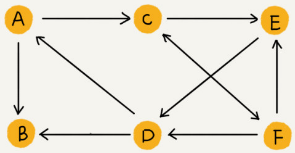

# 图

## 图的概念

图（Graph）和树比起来，是一种更加复杂的非线性表结构。

### 顶点&边

树中的元素称为节点，图中的元素叫作顶点（vertex）。图一个顶点可以与任意其他顶点建立连接关系，这种建立的关系叫边（edge）。

在微信中，可以把每个用户看作一个顶点，两个用户之间互加好友，那就在两者之间建立一条边。所以，整个微信的好友关系就可以用一张图来表示。其中，每个用户有多少个好友，对应到图中，就叫作顶点的度（degree），就是跟顶点相连接的边的条数。

### 有向图&无向图

微博允许单向关注，用户 A 关注了用户 B，但用户 B 可以不关注用户 A。如果用户 A 关注了用户 B，就在图中画一条从 A 到 B 的带箭头的边，来表示边的方向。如果用户 A 和用户 B 互相关注了，那我们就画一条从 A 指向 B 的边，再画一条从 B 指向 A 的边。

这种边有方向的图叫作“有向图”。边没有方向的图就叫作“无向图”。

无向图中的“度”表示一个顶点有多少条边，在有向图中度分为入度（In-degree）和出度（Out-degree）。

顶点的入度，表示有多少条边指向这个顶点；顶点的出度，表示有多少条边是以这个顶点为起点指向其他顶点。

对应到微博的例子，入度就表示有多少粉丝，出度就表示关注了多少人。

### 带权图

QQ 还记录了两个用户之间的亲密度，如果两个用户经常往来，那亲密度就比较高；如果不经常往来，亲密度就比较低。在带权图（weighted graph）中，每条边都有一个权重（weight），可以通过这个权重来表示 QQ 好友间的亲密度。

## 图的存储

### 邻接矩阵存储方法

邻接矩阵（Adjacency Matrix）的底层依赖一个二维数组。

对于无向图来说，如果顶点 `i` 与顶点 `j` 之间有边，就将 `A[i][j]` 和 `A[j][i]` 标记为 1；对于有向图来说，如果顶点 `i` 指向顶点 `j` 就将 `A[i][j]A[i][j]` 标记为1。同理，如果顶点 `j` 指向顶点 `i` 就将 `A[j][i]A[j][i]` 标记为 1。对于带权图，数组中就存储相应的权重。

用邻接矩阵来表示一个图，虽然简单、直观，但是比较浪费存储空间。对于无向图来说，如果 `A[i][j]` 等于 1，那 `A[j][i]` 也肯定等于 1，只需要存储上三角矩阵或下三角矩阵可以节省一半的空间。

稀疏图（Sparse Matrix）是指每个顶点的边不多的图，用邻接矩阵的存储方法会非常浪费空间。

但邻接矩阵的存储方式简单、直接，因为基于数组，所以在获取两个顶点的关系时，就非常高效。其次用邻接矩阵的方式存储图，可以将很多图的运算转换成矩阵之间的运算。比如求解最短路径的Floyd-Warshall 算法，就是利用矩阵循环相乘若干次得到结果。

### 邻接表存储方法

邻接表（Adjacency List）的每个顶点对应一条链表，链表中存储的是与这个顶点相连接的其他顶点。

无向图可以看作每条边都是双方向的有向图。

邻接矩阵存储起来比较浪费空间，但是使用起来比较节省时间。相反，邻接表存储起来比较节省空间，但是使用起来就比较耗时间。这是时间、空间复杂度互换的设计思想，前者是空间换时间，后者是时间换空间。

上图邻接表的例子中，如果要确定是否存在一条从顶点 2 到顶点 4 的边，就要遍历顶点 2 对应的那条链表，看链表中是否存在顶点 4。当然如果链过长，可以将链表换成红黑树、跳表、散列表等来提高查找效率，还可以将链表改成有序动态数组，通过二分查找的方法来快速定位两个顶点之间否存在边。

