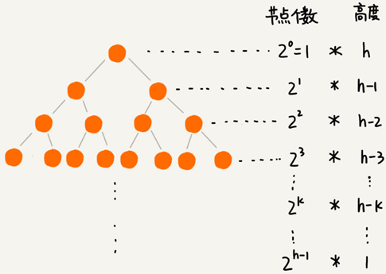

# 堆

## 堆的概念

堆是一种特殊的树：

- 堆是一个完全二叉树；
- 堆中每一个节点的值都必须大于等于（或小于等于）其子树中每个节点的值。

堆必须是一个完全二叉树，除了最后一层，其他层的节点个数都是满的，最后一层的节点都靠左排列。

堆中的每个节点的值必须大于等于（或者小于等于）其子树中每个节点的值。

- 对于每个节点的值都大于等于子树中每个节点值的堆叫“大顶堆”。
- 对于每个节点的值都小于等于子树中每个节点值的堆叫“小顶堆”。

## 存储一个堆

完全二叉树比较适合用数组来存储。用数组来存储完全二叉树，不需要存储左右子节点的指针，单纯地通过数组的下标，就可以找到一个节点的左右子节点和父节点。

上图中 `i=1` 存储根节点，下标为 `i` 的节点的左子节点就是下标为 `i∗2` 的节点，右子节点就是下标为 `i∗2+1` 的节点，父节点就是下标为`i/2` 的节点。

## 堆的基本操作

一个包含 `n` 个节点的完全二叉树高度小于 `log_{2}n`，堆化的时间复杂度跟树的高度成正比等于 `O(logn)`。插入数据和删除堆顶元素的主要逻辑就是堆化，所以，往堆中插入一个元素和删除堆顶元素的时间复杂度都是 `O(logn)`。

### 插入一个元素

往堆中插入一个元素后需要继续满足堆的两个特性。

把新插入的元素直接放到堆的最后，之前的堆就不再符合堆的特性。就需要进行调整，让其重新满足堆的特性，这个过程叫作**堆化**（heapify）。

堆化有从下往上和从上往下两种方法。

堆化就是顺着节点所在的路径，向上或者向下进行对比，然后交换。从下往上堆化是让新插入的节点与父节点对比大小。如果不满足子节点小于等于父节点的大小关系，就互换两个节点。一直重复这个过程，直到比对到根节点。

### 删除堆顶元素

堆的任何节点的值都大于等于（或小于等于）子树节点的值，堆顶元素存储的就是堆中数据的最大值或者最小值。

大顶堆的堆顶元素就是最大的元素，删除堆顶元素之后，就需要把第二大的元素放到堆顶，那第二大元素肯定会出现在左右子节点中。然后我们再迭代地删除第二大节点，以此类推，直到叶子节点被删除。

但这样操作完成后的堆不再满足完全二叉树的特性：

可以先把最后一个节点放到堆顶，然后从上往下的堆化。这种方法堆化之后的结果，肯定满足完全二叉树的特性：

## 基于堆实现堆排序

借助于堆这种数据结构实现的排序算法，就叫作堆排序。这种排序方法的时间复杂度非常稳定，是 `O(nlogn)`，并且它还是原地排序算法。

堆排序的过程可以大致分解成两个大的步骤，**建堆** 和 **排序**。

### 建堆

我们首先将数组原地建成一个堆。“原地”是指不借助另一个数组在原数组上操作。

建堆的两种思路：

- 假设起初堆中只包含一个数据，就是下标为 1 的数据。然后调用插入操作，将下标从 2 到 n 的数据依次插入到堆中。整个过程都是从下到上的堆化。
- 从后往前处理数组，找到第一个非叶子节点，然后依次从上往下堆化。

建堆操作的时间复杂度：

叶子节点不需要堆化，所以需要堆化的节点从倒数第二层开始。每个节点堆化的过程中，需要比较和交换的节点个数，跟这个节点的高度 `k` 成正比。将每个节点的高度求和，就可以得到建堆的时间复杂度。

将每个非叶子节点的高度求和：
$$
\mathrm{S}_{1}=1 * \mathrm{~h}+2^{1} *(\mathrm{~h}-1)+2^{2} *(\mathrm{~h}-2)+\cdots+2^{\mathrm{k}} *(\mathrm{~h}-\mathrm{k})+\cdots+2^{\mathrm{h}-1} * 1
$$
把公式左右都乘以 2 就得到公式 `S2`。将 `S2` 错位对齐并减去 `S1`，可以得到 `S`：

$$
\begin{array}{l}
\mathrm{S}_{1}=1 * \mathrm{~h}+2^{1} *(\mathrm{~h}-1)+2^{2} *(\mathrm{~h}-2)+\cdots+2^{\mathrm{k}} *(\mathrm{~h}-\mathrm{k})+\cdots+2^{\mathrm{h}-1} * 1 \\
\mathrm{~S}_{2}=\quad 2^{1} * \mathrm{~h}+2^{2} *(\mathrm{~h}-1)+\cdots+2^{\mathrm{k}} *(\mathrm{~h}-\mathrm{k}+1)+\cdots+2^{\mathrm{h}-1} * 2+2^{\mathrm{h}} * 1 \\
\mathrm{~S}=\mathrm{S}_{2}-\mathrm{S}_{1} \\
\quad=-\mathrm{h}+2^{1}+2^{2}+2^{3}+\cdots+2^{\mathrm{k}}+\cdots+2^{\mathrm{h}-1}+2^{\mathrm{h}} \\
\quad=-\mathrm{h}+\left(2^{\mathrm{h}}-2\right)+2^{\mathrm{h}} \\
\quad=2^{\mathrm{h}+1}-\mathrm{h}-2
\end{array}
$$
因为 `h=logn`，代入公式 `S`，就能得到 `S=O(n)`，所以，建堆的时间复杂度就是 `O(n)`。

### 排序

建堆结束之后，数组中的数据已经是按照大顶堆的特性来组织的。数组中的第一个元素就是堆顶，也就是最大的元素。把它跟最后一个元素交换，那最大元素就放到了下标为 `n` 的位置。

当堆顶元素移除之后，把下标为 `n` 的元素放到堆顶，然后再通过堆化的方法，将剩下的 `n−1` 个元素重新构建成堆。堆化完成之后再取堆顶的元素，放到下标是 `n−1` 的位置，一直重复这个过程，直到最后堆中只剩下标为 1 的一个元素，排序工作就完成了。

整个堆排序的过程，都只需要极个别临时存储空间，所以堆排序是原地排序算法。堆排序包括建堆和排序两个操作，建堆过程的时间复杂度是 `O(n)`，排序过程的时间复杂度是 `O(nlogn)`，所以，堆排序整体的时间复杂度是 `O(nlogn)`。

堆排序不是稳定的排序算法，因为在排序的过程，存在将堆的最后一个节点跟堆顶节点互换的操作，所以就有可能改变值相同数据的原始相对顺序。

上述实现中，堆中的数据是从数组下标为 1 的位置开始存储。如果从 0 开始存储，计算子节点和父节点的下标的公式就改变了。此时对于下标为i的节点，左子节点的下标是 `2∗i+1`，右子节点的下标是 `2∗i+2`，父节点的下标就是 `(i-1)/2`。

#### 为什么快速排序要比堆排序性能好？

**第一点，堆排序跳跃访问方式对CPU缓存不友好**

对于快速排序来说，数据是顺序访问的。而对于堆排序来说，数据是跳着访问的。 比如，堆排序中，最重要的一个操作就是数据的堆化。比如下面这个例子，对堆顶节点进行堆化，会依次访问数组下标是 `1，2，4，8` 的元素，而不是像快速排序那样，局部顺序访问，这样对 CPU 缓存是不友好的。

**第二点，对于同样的数据，在排序过程中，堆排序算法的数据交换次数要多于快速排序**

快速排序数据交换的次数不会比逆序度多，但堆排序的第一步是建堆，建堆的过程会打乱数据原有的相对先后顺序，导致原数据的有序度降低。比如，对于一组已经有序的数据来说，经过建堆之后，数据反而变得更无序了。

