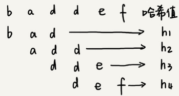
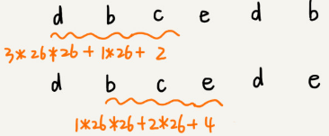
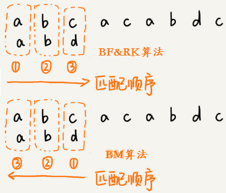
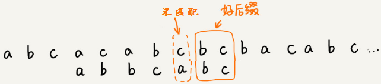
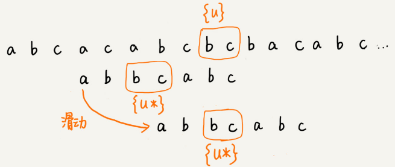
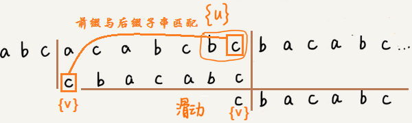
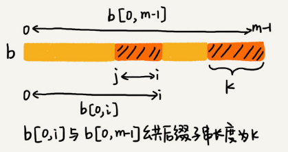

# 字符串匹配基础

单模式字符串匹配算法有简单的 BF 算法和 RK 算法，难懂的 BM 算法和 KMP 算法。

多模式字符串匹配算法，就是在一个串中同时查找多个串，有 Trie 树和 AC 自动机。

## BF 算法

BF （Brute Force）算法，中文叫作暴力匹配算法，也叫朴素匹配算法。这种算法的字符串匹配方式很“暴力”，比较简单、好懂，但相应的性能也不高。

主串和模式串的概念:比如在字符串 A 中查找字符串 B，那字符串 A 就是主串，字符串 B 就是模式串。

设主串的长度为 n，模式串的长度为 m，因为在主串中查找模式串，所以 n>m。


BF 算法每次都比对 m 个字符，最坏情况下要比对 `n-m+1` 次，所以最坏情况时间复杂度是 O(n*m)。

BF 算法虽然相对其他字符串匹配算法，时间复杂度高，但却是一个最常用的字符串匹配算法，因为大部分情况下，模式串和主串的长度都不会太长。另外BF算法思想简单，代码实现简单不容易出错，即使有 bug 也容易暴露和修复。

在工程中，在满足性能要求的前提下，简单是首选。这也是KISS（Keep it Simple and Stupid）设计原则。

## RK 算法

RK(Rabin-Karp) 算法由它的两位发明者 Rabin 和 Karp 的名字来命名。它算是BF算法的升级版。

先通过哈希算法对主串中的 `n-m+1` 个子串分别求哈希值，然后逐个与模式串的哈希值比较大小。如果某个子串的哈希值与模式串相等，那就再对比一下子串和模式串本身。如果子串的哈希值与模式串的哈希值不相等，那对应的子串和模式串肯定也是不匹配的。

因为哈希值是一个数字，数字之间比较是否相等是非常快速的，所以模式串和子串比较的效率就提高了。



哈希算法的设计的非常有技巧，假设要处理的字符串只包含 K 个字符，可以用一个 K 进制数来表示一个子串，这个 K 进制数转化成十进制数，作为子串的哈希值。

比如要处理的字符串只包含  `a～z` 这 26 个小写字母，那就用二十六进制来表示一个字符串，把 `a～z` 这 26 个字符映射到 0～25 这 26 个数字中：
$$
\begin{aligned}
{ }^{\prime} \mathrm{cba}^{\prime} &={ }^{\prime} \mathrm{c}^{\prime} * 26 * 26+{ }^{\prime} \mathrm{b}^{\prime} * 26+{ }^{\prime} \mathrm{a}^{\prime} * 1 \\
&=2 * 26 * 26+1 * 26+0 * 1 \\
&=1353
\end{aligned}
$$


相邻两个子串 `s[i-1]` 和 `s[i]`（`i` 表示子串在主串中的起始位置，子串的长度都为 `m`），对应的哈希值计算公式有交集，可以使用 `s[i-1]` 的哈希值计算出 `s[i]` 的哈希值：


`26 ^(m−1)`  这部分的计算可以通过查表的方法来提高效率，事先计算好 `26^0`、`26^1`、`26^2`、...、`26^{m-1}`，并且存储在一个长度为 `m` 的数组中，公式中的“次方”就对应数组的下标。当需要计算 26 的 `x` 次方的时候，就可以从数组的下标为 `x` 的位置取值，直接使用，省去了计算的时间。


整个 RK 算法包含两部分，计算子串哈希值和模式串哈希值与子串哈希值之间的比较。

计算子串哈希值可以通过设计特殊的哈希算法，只需要扫描一遍主串就能计算出所有子串的哈希值了，所以这部分的时间复杂度是 `O(n)`。

模式串哈希值与每个子串哈希值之间的比较的时间复杂度是 `O(1)`，总共需要比较 `n-m+1` 个子串的哈希值，所以，这部分的时间复杂度也是 `O(n)`。

RK 算法整体的时间复杂度就是 `O(n)`。

如果模式串很长，上面的哈希算法计算得到的哈希值可能超过计算机中整型数据的表示范围，这时就必须允许哈希冲突。

哈希算法的冲突概率要相对控制得低一些，如果存在大量冲突，就会导致 RK 算法的时间复杂度退化，效率下降。极端情况下，如果存在大量的冲突，每次都要再对比子串和模式串本身，那时间复杂度就会退化成 `O(n*m)`。

可以将每一个字母从小到大对应一个素数，然后将这些素数求和作为哈希值，这样数据范围就会相对上面的方法小很多，哈希冲突的概率也比较小。

## 二维字符串查找


假设二维主串和模式串的维度分别是 `m*n`和 `i*j`，横向在 `[0, m-i]`，纵向在 `[0, n-j]` 取起始点，然后取同样大小的子串窗口对比，共有 `(m-i+1)*(n-j+1)` 个子串，再用BM或RK算法进行逐个比较即可。

## BM 算法

BM（Boyer-Moore）算法，是一种非常高效的字符串匹配算法，原理很复杂，有实验统计它的性能是著名的KMP 算法的 3 到 4 倍。

模式串和主串的匹配过程可以看作模式串在主串中不停地往后滑动。当遇到不匹配的字符时，

BF 算法和 RK 算法的做法是模式串往后滑动一位，然后从模式串的第一个字符开始重新匹配：


而BM算法则是根据规则，跳过一些肯定不会匹配的情况，一次性把模式串往后多滑动几位:


BF 和 RK 算法按模式串的下标从小到大的顺序，依次与主串中的字符进行匹配的。而 BM 算法是按照模式串下标从大到小的顺序，倒着匹配的：



BM 算法包含坏字符规则（bad character rule）和好后缀规则（good suffix shift）。

模式串的末尾最后一个字符如果无法匹配，这个没有匹配的字符叫作坏字符（主串中的字符），此时使用坏字符规则进行滑动。

模式串的末尾最后一个字符可以匹配，末尾最大可匹配字符串称为好后缀，此时使用好后缀规则进行滑动。

### 坏字符规则

如下图，发现模式串末尾字符 `d` 跟主串末尾字符 `c` 无法匹配，则主串末尾字符 `c` 是坏字符。

拿坏字符 `c` 在模式串中查找，发现模式串中并不存在这个字符，这时可以将模式串直接往后滑动到坏字符 `c` 后面的位置，继续匹配：


这时坏字符 `a` 在模式串中是存在的，则将模式串滑动到让两个 `a` 上下对齐，如果坏字符在模式串出现多次，则将模式串最后出现的坏字符与主串中的坏字符对齐：


假设模式串末尾角标 `si`，坏字符最后一次在模式串出现的位置是`xi`（未出现记为-1），则模式串往后移动的位数等于 `si-xi`。


BM 算法单纯使用坏字符规则，在最好情况下的时间复杂度是 `O(n/m)`。比如，主串是 `aaabaaabaaabaaab`，模式串是 `aaaa`。每次比对，模式串都可以直接后移四位。

### 好后缀规则

如果模式串和主串末尾的字符可以匹配，则最大可匹配字符bc是好后缀：



将好后缀 `bc` 记作 `{u}`。如果在模式串中可以找到其他匹配 `{u}` 的子串，将最后一个匹配的子串记为 `{u*}`。模式串滑动到 `{u*}` 与主串的 `{u}` 对齐的位置：



如果在模式串中找不到另一个可以匹配 `{u}` 的子串，此时还需要根据主串 `{u}` 的后缀子串和模式串的前缀子串是否匹配分两种情况。比如 `abc` 的后缀子串有 `c` 和 `bc`，前缀子串有 `a` 和 `ab`。

如果主串 `{u}` 的后缀子串和模式串的前缀子串能够匹配，则将最长的能够匹配的部分记为 `{v}`。然后可以将模式串滑动到如下图所示的位置：


1.模式串的任何前缀子串也无法与 `{u}` 的任何后缀子串匹配，则可以将模式串滑动到 `{u}` 后面的位置：


2.模式串的前缀子串 `{v}` 与 `{u}` 的后缀子串匹配，则可以将模式串滑动到模式串的前缀子串与主串{u}的后缀子串对齐的位置：



### BM 算法代码实现
为了快速查找坏字符在模式串中出现的位置，可以将每个坏字符对应的角标位置存储在散列表中，键为字符，值为坏字符在模式串最后一次出现的位置。

假设字符串的字符集是 ASCII 码值，可以用大小为 256 的数组实现散列表，用数组的下标来代表字符的ASCII 码值，具体存储坏字符在模式串中最后一次出现的位置。如果字符串的字符集范围非常大，就使用常规方法实现散列表。


为了快速查找跟好后缀 `{u}` 最后一个相匹配的后缀子串 `{u*}`，将后缀子串的长度和相匹配的 `{u*}` 位置保存起来。

用 `suffix` 数组来保存，下标表示后缀子串的长度，值存储在模式串中跟好后缀 `{u}` 最后一个相匹配的子串 `{u*}` 的起始下标值。

另外用bool类型的prefix 数组存储该长度的后缀是否与前缀匹配。


计算过程：拿下标从 0 到 `i` 的子串（i 可以是 0 到 `m-2`）与整个模式串，求公共后缀子串。

如果公共后缀子串的长度是 `k`，就记录 `suffix[k]=j`（`j` 表示公共后缀子串的起始下标）。如果 `j` 等于 0，公共后缀子串也是模式串的前缀子串，就记录 `prefix[k]=true`。



假设好后缀的长度是 `k`。如果 `suffix[k]` 不等于 `-1`，就将模式串往后滑动 `j-suffix[k]+1` 位（`j` 表示坏字符对应的模式串中的字符下标）。


如果 `suffix[k]` 等于 `-1`，并且在 `prefix` 数组 `[k,1]` 的范围中查找到 `prefix[r]=true` (第一个找到的)，此时将模式串滑动 `m-r` 位即可。未找到时 `r=0`:


## KMP算法

Knuth-Morris-Pratt 字符串查找算法，简称为 **KMP算法**，用于在一个主串S内查找一个模式串P的出现位置。

这个算法由 Donald Knuth、Vaughan Pratt、James H. Morris 三人于 1977 年联合发表，故取这 3 人的姓氏命名此算法。

KMP 算法的核心思想是在模式串和主串匹配的过程中，每当遇到坏字符后，对于已经比对过的好前缀，根据某种规律将模式串一次性滑动很多位。

### 基本原理

在模式串和主串匹配的过程中，把不能匹配的那个字符仍然叫作**坏字符**，把已经匹配的那段字符串叫作**好前缀**。


在好前缀本身的所有后缀子串中，查找最长的可以跟好前缀的前缀子串匹配的。假设最长的可匹配的前缀子串是 `{v}`，长度是 `k`。每次遇到坏字符的时候就把 `j` 更新为 `k`，`i` 不变，然后继续比较。相当于把模式串一次性往后滑动 `j-k` 位。


前缀 指除了最后一个字符以外，一个字符串的全部头部组合；后缀 指除了第一个字符以外，一个字符串的全部尾部组合。

为了表述起来方便，将好前缀的所有后缀子串中，最长的前缀子串匹配的后缀子串，叫作最长可匹配后缀子串；对应的前缀子串，叫作最长可匹配前缀子串。


以模式串abaabcac为例，列出模式串 P 的所有子串：

```
a ab aba abaa abaab abaabc abaabca abaabcac
```

求得模式串 P 的每一个子串对应的各个前缀后缀的公共元素的 **最大长度表** :


很多教材称 next 数组叫失效函数（failure function），但每本教材对next函数定义的细节都有差别。

根据最大长度表 去求 next 数组：next 数组相当于“最大长度值” 整体向右移动一位，然后初始值赋为 `-1`。


操作流程：

- 假设现在主串 `M` 匹配到 `i` 位置，模式串 `P` 匹配到 `j` 位置
- 如果 `j = -1`，或者当前字符匹配成功（即 `M[i] == P[j]` ），都令 `i++`，`j++`，继续匹配下一个字符；
- 如果 `j != -1`，且当前字符匹配失败（即 `M[i] != P[j]` ），则令 `i` 不变，`j = next[j]`。 匹配失败时，模式串 `P` 相对于主串 `M` 向右移动了 `j - next [j]` 位
- 换言之，将模式串 `P` 失配位置的 next 数组的值对应的模式串 `P` 的索引位置移动到失配处

### 快速求出next 数组的方法

假设已经求得abaa这一列的最大公共前后缀的长度为1，在它后面添加一个与前缀匹配的字符即可使最大公共前后缀变长。

即下一列添加的字符与当前列的最大公共前后缀的长度后面的字符一样，则最大公共前后缀长度的长度加1。

但如果下一列添加的字符与当前列的最大公共前后缀的长度后面的字符不一样，则最大公共前后缀长度的长度置为0，重新开始判断：


另一种求解思路是将求 next 数组的过程看成字符串匹配的过程：以模式字符串为主字符串，以模式字符串的前缀为目标字符串，一旦字符串匹配成功，那么当前的 next 值就是匹配成功的字符串的长度。

从模式字符串的第一位(注意，不包括第0位)开始对自身进行匹配运算。 在任一位置，能匹配的最长长度就是当前位置的 next 值：


### KMP 算法复杂度分析

KMP 算法只需要一个额外的 next 数组，数组的大小跟模式串相同。所以空间复杂度是 `O(m)`，`m` 表示模式串的长度。

KMP 算法包含两部分，第一部分是构建 next 数组，第二部分是借助 next 数组进行匹配。

构建 next 数组，仅一层循环，循环次数跟模式串长度 `m` 有关，所以构建 next 数组的时间复杂度是 `O(m)`。借助 next 数组进行匹配。

`i` 从 0 循环增长到 `n-1`，`j` 的总增长量与 `i` 一致也为n。`j = next[j]` 让 `j` 的值减少，但总减少量不会超过总增长量 `n`。所以 while 循环的循环次数小于 `2n`，借助 next 数组进行匹配的时间复杂度是 `O(n)`。

故综合两部分的时间复杂度，KMP 算法的时间复杂度是 `O(m+n)`。


