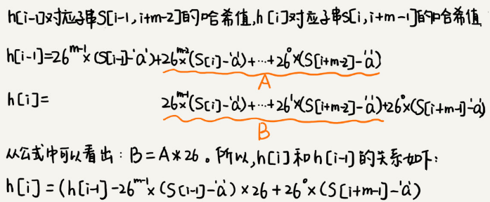

# 字符串匹配基础

单模式字符串匹配算法有简单的 BF 算法和 RK 算法，难懂的 BM 算法和 KMP 算法。

多模式字符串匹配算法，就是在一个串中同时查找多个串，有 Trie 树和 AC 自动机。

## BF 算法

BF （Brute Force）算法，中文叫作暴力匹配算法，也叫朴素匹配算法。这种算法的字符串匹配方式很“暴力”，比较简单、好懂，但相应的性能也不高。

主串和模式串的概念:比如在字符串 A 中查找字符串 B，那字符串 A 就是主串，字符串 B 就是模式串。

设主串的长度为 n，模式串的长度为 m，因为在主串中查找模式串，所以 n>m。

BF 算法每次都比对 m 个字符，最坏情况下要比对 `n-m+1` 次，所以最坏情况时间复杂度是 O(n*m)。

BF 算法虽然相对其他字符串匹配算法，时间复杂度高，但却是一个最常用的字符串匹配算法，因为大部分情况下，模式串和主串的长度都不会太长。另外BF算法思想简单，代码实现简单不容易出错，即使有 bug 也容易暴露和修复。

在工程中，在满足性能要求的前提下，简单是首选。这也是KISS（Keep it Simple and Stupid）设计原则。

## RK 算法

RK(Rabin-Karp) 算法由它的两位发明者 Rabin 和 Karp 的名字来命名。它算是BF算法的升级版。

先通过哈希算法对主串中的 `n-m+1` 个子串分别求哈希值，然后逐个与模式串的哈希值比较大小。如果某个子串的哈希值与模式串相等，那就再对比一下子串和模式串本身。如果子串的哈希值与模式串的哈希值不相等，那对应的子串和模式串肯定也是不匹配的。

因为哈希值是一个数字，数字之间比较是否相等是非常快速的，所以模式串和子串比较的效率就提高了。

哈希算法的设计的非常有技巧，假设要处理的字符串只包含 K 个字符，可以用一个 K 进制数来表示一个子串，这个 K 进制数转化成十进制数，作为子串的哈希值。

比如要处理的字符串只包含  `a～z` 这 26 个小写字母，那就用二十六进制来表示一个字符串，把 `a～z` 这 26 个字符映射到 0～25 这 26 个数字中：
$$
\begin{aligned}
{ }^{\prime} \mathrm{cba}^{\prime} &={ }^{\prime} \mathrm{c}^{\prime} * 26 * 26+{ }^{\prime} \mathrm{b}^{\prime} * 26+{ }^{\prime} \mathrm{a}^{\prime} * 1 \\
&=2 * 26 * 26+1 * 26+0 * 1 \\
&=1353
\end{aligned}
$$

相邻两个子串 `s[i-1]` 和 `s[i]`（`i` 表示子串在主串中的起始位置，子串的长度都为 `m`），对应的哈希值计算公式有交集，可以使用 `s[i-1]` 的哈希值计算出 `s[i]` 的哈希值：

`26 ^(m−1)`  这部分的计算可以通过查表的方法来提高效率，事先计算好 `26^0`、`26^1`、`26^2`、...、`26^{m-1}`，并且存储在一个长度为 `m` 的数组中，公式中的“次方”就对应数组的下标。当需要计算 26 的 `x` 次方的时候，就可以从数组的下标为 `x` 的位置取值，直接使用，省去了计算的时间。

整个 RK 算法包含两部分，计算子串哈希值和模式串哈希值与子串哈希值之间的比较。

计算子串哈希值可以通过设计特殊的哈希算法，只需要扫描一遍主串就能计算出所有子串的哈希值了，所以这部分的时间复杂度是 `O(n)`。

模式串哈希值与每个子串哈希值之间的比较的时间复杂度是 `O(1)`，总共需要比较 `n-m+1` 个子串的哈希值，所以，这部分的时间复杂度也是 `O(n)`。

RK 算法整体的时间复杂度就是 `O(n)`。

如果模式串很长，上面的哈希算法计算得到的哈希值可能超过计算机中整型数据的表示范围，这时就必须允许哈希冲突。

哈希算法的冲突概率要相对控制得低一些，如果存在大量冲突，就会导致 RK 算法的时间复杂度退化，效率下降。极端情况下，如果存在大量的冲突，每次都要再对比子串和模式串本身，那时间复杂度就会退化成 `O(n*m)`。

可以将每一个字母从小到大对应一个素数，然后将这些素数求和作为哈希值，这样数据范围就会相对上面的方法小很多，哈希冲突的概率也比较小。

## 二维字符串查找

假设二维主串和模式串的维度分别是 `m*n`和 `i*j`，横向在 `[0, m-i]`，纵向在 `[0, n-j]` 取起始点，然后取同样大小的子串窗口对比，共有 `(m-i+1)*(n-j+1)` 个子串，再用BM或RK算法进行逐个比较即可。

## BM 算法

