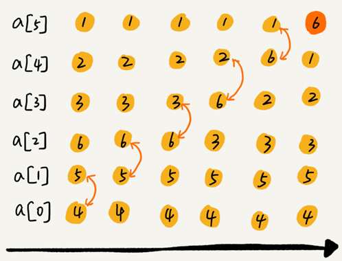

# 排序算法

最常用的排序算法：

- 冒泡排序
- 插入排序
- 选择排序
- 归并排序
- 快速排序
- 计数排序
- 基数排序
- 桶排序

## 排序算法的三个分析指标

### 排序算法的执行效率

一般从这几个方面来衡量：

- 最好情况、最坏情况、平均情况时间复杂度

- 比较次数和交换（或移动）次数

  基于比较的排序算法的执行过程，会涉及元素比较大小和元素交换或移动两种操作。在分析排序算法的执行效率的时候，应该把比较次数和交换（或移动）次数也考虑进去。

### 排序算法的内存消耗

算法的内存消耗可以通过空间复杂度来衡量。

原地排序（Sorted in place）算法，是特指空间复杂度是 `O(1)` 的排序算法。

### 排序算法的稳定性

稳定性是指如果待排序的序列中存在值相等的元素，经过排序之后，相等元素之间原有的先后顺序不变。

## “有序度”和“逆序度”

### “有序度”

有序度是数组中具有有序关系的元素对的个数。

比如 `2,4,3,1,5,6` 这组数据的有序度为11，因为有序对为11个，分别是：
$$
\begin{array}{r}
(2,4) \quad(2,3) \quad(2,5) \quad(2,6) \\
(4,5) \quad(4,6) \quad(3,5) \quad(3,6) \\
(1,5) \quad(1,6) \quad(5,6)
\end{array}
$$
对于一个倒序排列的数组，比如 `6,5,4,3,2,1` 有序度是 0；对于一个完全有序的数组，比如 `1,2,3,4,5,6` 有序度就是 `n*(n-1)/2n`，也就是 15。这种完全有序的数组的有序度叫作满有序度。

### “逆序度”

逆序度的定义正好跟有序度相反。

```
逆序度 = 满有序度 - 有序度
```

排序的过程就是一种增加有序度，减少逆序度的过程，最后达到满有序度，就说明排序完成了。

## 时间复杂度O(n^2)的三种排序算法

### 冒泡排序（Bubble Sort）

冒泡排序只会操作相邻的两个数据。每次冒泡操作都会对相邻的两个元素进行比较，看是否满足大小关系要求。如果不满足就让它俩互换。一次冒泡会让至少一个元素移动到它应该在的位置，重复 n 次，就完成了 n 个数据的排序工作。
比如对一组数据 `4,5,6,3,2,1` 从小到到大进行排序的，第一趟冒泡过程是：



经过一次冒泡操作之后，`6` 这个元素已经存储在正确的位置上。要想完成所有数据的排序，只要进行 6 次这样的冒泡操作就行了：


这个冒泡过程还可以优化。当某次冒泡操作已经没有数据交换时，说明已经达到完全有序，不用再继续执行后续的冒泡操作。比如下图给 6 个元素排序，只需要 4 次冒泡操作就可以了：


```
void bubble_sort(vector<int>& arr)
{
	const int n = arr.size();
	for (int i = n - 1; i > 0; i--)
	{
		bool falg = false;
		for (int j = 0; j < i; j++)
		{
			if (arr[j + 1] < arr[j])
			{
				falg = true;
				swap(arr[j + 1], arr[j]);
			}
		}
		if (falg == false)
			break;
	}
}
```


小结：**

- 冒泡排序是一种原地排序算法
- 冒泡排序是一种稳定的排序算法
- 最好情况时间复杂度是 `O(n)`，最坏情况时间复杂度为 `O(n^2)`，平均情况下的时间复杂度就是 `O(n^2 )`

### 插入排序（Insertion Sort）

一个有序的数组，只要遍历数组找到数据应该插入的位置将其插入，就能继续保持数组有序。


插入排序将数组中的数据分为两个区间，已排序区间和未排序区间。初始已排序区间只有一个元素，就是数组的第一个元素。取未排序区间中的元素，在已排序区间中找到合适的插入位置将其插入，并保证已排序区间数据一直有序。重复这个过程，直到未排序区间中元素为空，算法结束。

如下图，要排序的数据是 `4，5，6，1，3，2` 其中左侧为已排序区间，右侧是未排序区间：


插入排序也包含两种操作，一种是元素的比较，一种是元素的移动。当我们需要将一个数据 `a` 插入到已排序区间时，需要拿 `a` 与已排序区间的元素依次比较大小，找到合适的插入位置。找到插入点之后，我们还需要将插入点之后的元素顺序往后移动一位，这样才能腾出位置给元素 `a` 插入。

对于一个给定的初始序列，移动操作的次数总是固定的，就等于逆序度。

```
void insert_sort(vector<int>& arr)
{
	const int n = arr.size();
	for (int i = 1; i < n; i++)
	{
		int value = arr[i];
		int j = i - 1;		
		while (j >= 0 && arr[j] > value)
		{
			arr[j + 1] = arr[j];
			j--;
		}
		arr[j + 1] = value;
	}
}
```


**小结：**

- 插入排序是一种原地排序算法
- 插入排序是一种稳定的排序算法
- 最好情况时间复杂度是 `O(n)`，最坏情况时间复杂度为 `O(n^2)`，平均情况下的时间复杂度就是 `O(n^2 )`

### 选择排序（Selection Sort）

选择排序算法也分已排序区间和未排序区间，每次会从未排序区间中找到最小的元素，将其放到已排序区间的末尾。


```
void select_sort(vector<int>& arr)
{
	const int n = arr.size();
	for (int i = 0; i < n; i++)
	{
		int minIndex = i;
		for (int j = i + 1; j < n; j++)
		{
			if (arr[j] < arr[minIndex])
				minIndex = j;
		}
		if (minIndex != i)
			swap(arr[i], arr[minIndex]);
	}
}
```


**小结：**

- 插入排序是一种原地排序算法
- 插入排序是一种不稳定的排序算法。
- 最好情况时间复杂度，最坏情况时间复杂度，平均情况下的时间复杂度都是 `O(n^2 )`

### 三种时间复杂度是 O(n^2)的排序算法小结


对比算法复杂度可知，使用冒泡排序和插入排序在最好的情况下能够获得比较好的时间复杂度。

对比冒泡排序和插入排序，因为冒泡排序需要复杂的交换操作，而插入排序采用的是移动操作，所以插入排序可能带来更好的性能。