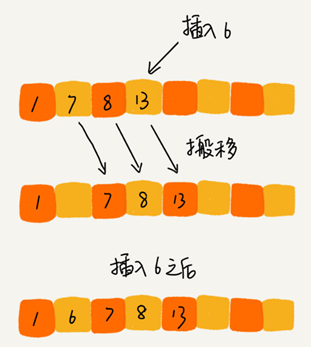
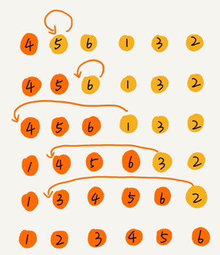
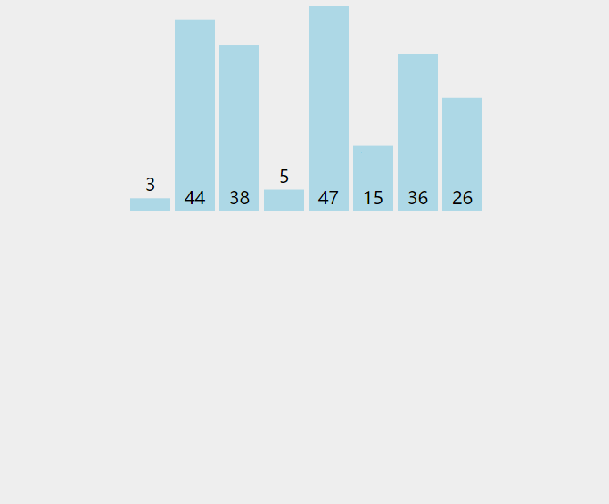
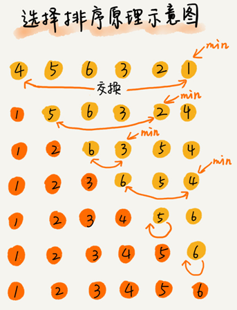
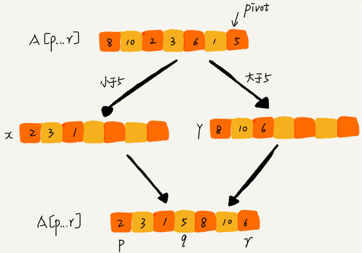
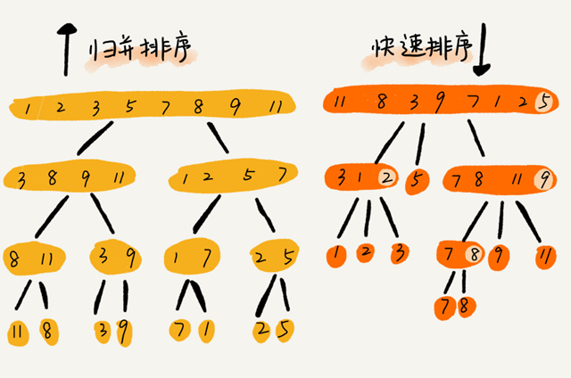

# 排序算法

最常用的排序算法：

- 冒泡排序
- 插入排序
- 选择排序
- 归并排序
- 快速排序
- 计数排序
- 基数排序
- 桶排序

## 排序算法的三个分析指标

### 排序算法的执行效率

一般从这几个方面来衡量：

- 最好情况、最坏情况、平均情况时间复杂度

- 比较次数和交换（或移动）次数

  基于比较的排序算法的执行过程，会涉及元素比较大小和元素交换或移动两种操作。在分析排序算法的执行效率的时候，应该把比较次数和交换（或移动）次数也考虑进去。

### 排序算法的内存消耗

算法的内存消耗可以通过空间复杂度来衡量。

原地排序（Sorted in place）算法，是特指空间复杂度是 `O(1)` 的排序算法。

### 排序算法的稳定性

稳定性是指如果待排序的序列中存在值相等的元素，经过排序之后，相等元素之间原有的先后顺序不变。

## “有序度”和“逆序度”

### “有序度”

有序度是数组中具有有序关系的元素对的个数。

比如 `2,4,3,1,5,6` 这组数据的有序度为11，因为有序对为11个，分别是：
$$
\begin{array}{r}
(2,4) \quad(2,3) \quad(2,5) \quad(2,6) \\
(4,5) \quad(4,6) \quad(3,5) \quad(3,6) \\
(1,5) \quad(1,6) \quad(5,6)
\end{array}
$$
对于一个倒序排列的数组，比如 `6,5,4,3,2,1` 有序度是 0；对于一个完全有序的数组，比如 `1,2,3,4,5,6` 有序度就是 `n*(n-1)/2n`，也就是 15。这种完全有序的数组的有序度叫作满有序度。

### “逆序度”

逆序度的定义正好跟有序度相反。

```
逆序度 = 满有序度 - 有序度
```

排序的过程就是一种增加有序度，减少逆序度的过程，最后达到满有序度，就说明排序完成了。

## 时间复杂度 O(n^2) 的三种排序算法

### 冒泡排序（Bubble Sort）

冒泡排序只会操作相邻的两个数据。每次冒泡操作都会对相邻的两个元素进行比较，看是否满足大小关系要求。如果不满足就让它俩互换。一次冒泡会让至少一个元素移动到它应该在的位置，重复 n 次，就完成了 n 个数据的排序工作。
比如对一组数据 `4,5,6,3,2,1` 从小到到大进行排序的，第一趟冒泡过程是：


经过一次冒泡操作之后，`6` 这个元素已经存储在正确的位置上。要想完成所有数据的排序，只要进行 6 次这样的冒泡操作就行了：


这个冒泡过程还可以优化。当某次冒泡操作已经没有数据交换时，说明已经达到完全有序，不用再继续执行后续的冒泡操作。比如下图给 6 个元素排序，只需要 4 次冒泡操作就可以了：


```
void bubble_sort(vector<int>& arr)
{
	const int n = arr.size();
	for (int i = n - 1; i > 0; i--)
	{
		bool falg = false;
		for (int j = 0; j < i; j++)
		{
			if (arr[j + 1] < arr[j])
			{
				falg = true;
				swap(arr[j + 1], arr[j]);
			}
		}
		if (falg == false)
			break;
	}
}
```


小结：**

- 冒泡排序是一种原地排序算法
- 冒泡排序是一种稳定的排序算法
- 最好情况时间复杂度是 `O(n)`，最坏情况时间复杂度为 `O(n^2)`，平均情况下的时间复杂度就是 `O(n^2 )`

### 插入排序（Insertion Sort）

一个有序的数组，只要遍历数组找到数据应该插入的位置将其插入，就能继续保持数组有序。



插入排序将数组中的数据分为两个区间，已排序区间和未排序区间。初始已排序区间只有一个元素，就是数组的第一个元素。取未排序区间中的元素，在已排序区间中找到合适的插入位置将其插入，并保证已排序区间数据一直有序。重复这个过程，直到未排序区间中元素为空，算法结束。

如下图，要排序的数据是 `4，5，6，1，3，2` 其中左侧为已排序区间，右侧是未排序区间：



插入排序也包含两种操作，一种是元素的比较，一种是元素的移动。当我们需要将一个数据 `a` 插入到已排序区间时，需要拿 `a` 与已排序区间的元素依次比较大小，找到合适的插入位置。找到插入点之后，我们还需要将插入点之后的元素顺序往后移动一位，这样才能腾出位置给元素 `a` 插入。

对于一个给定的初始序列，移动操作的次数总是固定的，就等于逆序度。

```
void insert_sort(vector<int>& arr)
{
	const int n = arr.size();
	for (int i = 1; i < n; i++)
	{
		int value = arr[i];
		int j = i - 1;		
		while (j >= 0 && arr[j] > value)
		{
			arr[j + 1] = arr[j];
			j--;
		}
		arr[j + 1] = value;
	}
}
```



**小结：**

- 插入排序是一种原地排序算法
- 插入排序是一种稳定的排序算法
- 最好情况时间复杂度是 `O(n)`，最坏情况时间复杂度为 `O(n^2)`，平均情况下的时间复杂度就是 `O(n^2 )`

### 选择排序（Selection Sort）

选择排序算法也分已排序区间和未排序区间，每次会从未排序区间中找到最小的元素，将其放到已排序区间的末尾。



```
void select_sort(vector<int>& arr)
{
	const int n = arr.size();
	for (int i = 0; i < n; i++)
	{
		int minIndex = i;
		for (int j = i + 1; j < n; j++)
		{
			if (arr[j] < arr[minIndex])
				minIndex = j;
		}
		if (minIndex != i)
			swap(arr[i], arr[minIndex]);
	}
}
```


**小结：**

- 插入排序是一种原地排序算法
- 插入排序是一种不稳定的排序算法
- 最好情况时间复杂度，最坏情况时间复杂度，平均情况下的时间复杂度都是 `O(n^2 )`

### 三种时间复杂度是 O(n^2)的排序算法小结


对比算法复杂度可知，使用冒泡排序和插入排序在最好的情况下能够获得比较好的时间复杂度。

对比冒泡排序和插入排序，因为冒泡排序需要复杂的交换操作，而插入排序采用的是移动操作，所以插入排序可能带来更好的性能。

## 希尔排序（Shell Sort）

希尔排序也称递减增量排序算法，是基于插入排序的改进版本。 基本思想是： 先将整个待排序的记录序列分割成为若干子序列分别进行直接插入排序，待整个序列中的记录"基本有序"时,再对全体记录进行依次直接插入排序。

```
void shell_sort(vector<int>& arr)
{
	const int n = arr.size();
	for (int gap = n / 2; gap > 0; gap /= 2)
	{
		for (int i = 0; i < gap; i++)
		{
			for (int j = i + gap; j < n; j += gap)
			{
				if (arr[j - gap] > arr[j])
				{
					int value = arr[j];
					int k = j - gap;
					while (k >= 0 && arr[k] > value)
					{
						arr[k + gap] = arr[k];
						k -= gap;
					}
					arr[k + gap] = value;
				}
			}
		}
	}
}
```


## 时间复杂度 O(nlogn) 的三种排序算法

归并排序和快速排序是时间复杂度为 `O(nlogn)` 的排序算法，这两种排序算法适合大规模的数据排序，比时间复杂度为 `O(n^2)` 的排序算法要更常用。

### 归并排序（Merge Sort）

归并排序使用的就是分治思想。分治，顾名思义，就是分而治之，将一个大问题分解成小的子问题来解决。小的子问题解决了，大问题也就解决了。

分治算法一般都是用递归来实现的。分治是一种解决问题的处理思想，递归是一种编程技巧。

归并排序的核心思想，如果要排序一个数组，先把数组从中间分成前后两部分，然后对前后两部分分别排序，再将排好序的两部分合并在一起，这样整个数组就都有序了。


merge函数实现原理：


```
void merge(vector<int>& arr, int low, int mid, int high)
{
	int i = low, j = mid + 1, index = 0;
	vector<int> tmp(high - low + 1, 0);//@ 辅助数组
	while (i <= mid && j <= high)
	{
		if (arr[i] <= arr[j])
			tmp[index++] = arr[i++];
		else
			tmp[index++] = arr[j++];
	}

	while (i <= mid)
		tmp[index++] = arr[i++];
	while (j <= high)
		tmp[index++] = arr[j++];
	for (i = low, index = 0; i <= high; i++, index++)
		arr[i] = tmp[index];
}

void merge_sort(vector<int>& arr, int low, int high)
{
	if (low >= high)
		return;
	int mid = low + ((high - low) >> 1);
	merge_sort(arr, low, mid);
	merge_sort(arr, mid + 1, high);
	merge(arr, low, mid, high);
}
```


**小结：**

- 归并排序是一种稳定的排序算法
- 最好情况、最坏情况，还是平均情况，时间复杂度都是 `O(nlogn)`
- 归并排序不是原地排序算法，在合并两个有序数组为一个有序数组时，需要借助额外的存储空间，空间复杂度是 `O(n)`

### 快速排序（Quick Sort）

快排采用分治的思想，被排序数组中下标从 `p` 到 `r` ，选择 `p` 到 `r` 之间的任意一个数据作为 pivot（分区点）。遍历 `p` 到 `r` 之间的数据，将小于 pivot 的放到左边，将大于 pivot 的放到右边，将 pivot 放到中间。这样数组 `p` 到 `r` 之间的数据就被分成了三个部分，前面 `p` 到 `q-1` 之间都是小于 pivot 的，中间是 pivot，后面的 `q+1` 到 `r` 之间是大于 pivot 的。


根据分治、递归的处理思想，递归排序下标从 `p` 到 `q-1` 之间的数据和下标从 `q+1` 到 `r` 之间的数据，直到区间缩小为 1，就说明所有的数据都有序了。

如果不考虑空间消耗的话，`partition()` 分区函数可以写得非常简单。申请两个临时数组 `X` 和 `Y`，遍历 `A[p…r]`，将小于 `pivot` 的元素都拷贝到临时数组 `X，将大于 pivot` 的元素都拷贝到临时数组 `Y`，最后再将数组 `X` 和数组 `Y` 中数据顺序拷贝到 `A[p…r]`。



但如果按照这种思路实现 `partition()` 函数就需要很多额外的内存空间，快排就不是原地排序算法了。

如果希望快排是原地排序算法，它的空间复杂度得是 `O(1)`，那 `partition()` 分区函数就不能占用太多额外的内存空间，需要在 `A[p…r]` 的原地完成分区操作。


```
int partition(vector<int>& arr, int left, int right)
{
	int pivot = arr[left];
	int i = left + 1, j = right;
	while (true)
	{
		while (i <= j && arr[i] <= pivot)
			i++;
		while (i <= j && arr[j] >= pivot)
			j--;
		if (i > j)
			break;
		swap(arr[i],arr[j]);
	}
	swap(arr[j],arr[left]);
	return j; //@ 为什么返回j而不是i，因为swap是先执行i++的while语句，如果和下面的替换顺序，则返回i
}

void quick_sort(vector<int>& arr, int left, int right)
{
	if (left >= right)
		return;
	int pos = partition(arr, left, right);
	quick_sort(arr, left, pos - 1);
	quick_sort(arr, pos + 1, right);
}
```


**小结：**

- 快排是一种原地排序算法

- 快排是一种不稳定的排序算法

- 时间复杂度分析：

  如果每次分区操作，都能正好把数组分成大小接近相等的两个小区间，那快排的时间复杂度递推求解公式跟归并是相同的，时间复杂度也是 `O(nlogn)`，但是并不能每次分区操作都正好能将大区间对等地一分为二，如果数组中的数据原来已经是有序的了，比如 `1，3，5，6，8`。每次选择最后一个元素作为 `pivot`，那每次分区得到的两个区间都是不均等的。需要进行大约 `n` 次分区操作，才能完成快排的整个过程。每次分区平均要扫描大约 `n/2` 个元素，这种情况下，快排的时间复杂度就从 `O(nlogn)` 退化成了 `O(n^2)`。

  分区极其均衡和分区极其不均衡，两个极端情况下，分别对应快排的最好情况时间复杂度和最坏情况时间复杂度。在大部分情况下的时间复杂度都可以做到 `O( nlogn)`，只有在极端情况下，才会退化到 `O(n^2)`。平均情况时间复杂度为 `O(nlogn)`。

**快速排序的另一种分区实现：**

思路：

- 随机选取基准值, 并将基准值替换到数组第一个元素
- 选取第一个元素作为基准值
- 从右向左查找一个比基准值小的元素替换左指针的元素
- 从左向右查找一个比基准值大的元素替换右指针的元素
- 直到左指针与右指针之间没有元素
- 最后左指针与右指针共同指向的位置就是分区点，将分区点的值设置为基准值

```
int partition(vector<int>& arr, int left, int right)
{
	int pivot = arr[left];
	int i = left + 1, j = right;
	while (true)
	{
		while (i <= j && arr[i] <= pivot)
			i++;
		while (i <= j && arr[j] >= pivot)
			j--;
		if (i > j)
			break;
		swap(arr[i], arr[j]);
	}
	swap(arr[j], arr[left]);
	return j; //@ 为什么返回j而不是i，因为swap是先执行i++的while语句，如果和下面的替换顺序，则返回i
}

int randomPartition(vector<int>& arr, int left, int right)
{
	int pos = (rand() % (right - left + 1)) + left;
	swap(arr[left], arr[pos]);
	return partition(arr, left, right);
}

void quick_sort(vector<int>& arr, int left, int right)
{
	if (left >= right)
		return;
	int pos = randomPartition(arr, left, right);
	quick_sort(arr, left, pos - 1);
	quick_sort(arr, pos + 1, right);
}
```

### 快排和归并排序小结



归并排序的处理过程是由下到上的，先处理子问题，然后再合并。快速排序的处理过程是由上到下的，先分区，然后再处理子问题。

## 时间复杂度为 O(n) 的三种排序算法

因为这些排序算法的时间复杂度是线性的，所以我们把这类排序算法叫作线性排序（Linear sort）。

这三个算法都不涉及元素之间的比较操作，是不基于比较的排序算法。

### 桶排序（Bucket sort）

桶排序核心思想是将要排序的数据分到几个有序的桶里，每个桶里的数据再单独进行排序。桶内排完序之后，再把每个桶里的数据按照顺序依次取出，组成的序列就是有序的了。


```
void bucket_sort(vector<int>& arr, int bucket_size)
{
	if (arr.size() <= 1)
		return;

	const int n = arr.size();
	int low = *min_element(arr.begin(), arr.end());
	int high = *max_element(arr.begin(), arr.end());
	int bucket_count = (high - low) / bucket_size + 1;
	vector<vector<int>> buckets(bucket_count);
	for (int i = 0; i < n; i++)
		buckets[(arr[i] - low) / bucket_size].push_back(arr[i]);

	int index = 0;
	for (int i = 0; i < bucket_count; i++)
	{
		sort(buckets[i].begin(), buckets[i].end());
		for (int j = 0; j < buckets[i].size(); j++)
			arr[index++] = buckets[i][j];
	}
}
```

如果要排序的数据有 `n` 个均匀地划分到 `m` 个桶内，每个桶里就有 `k=n/m` 个元素。每个桶内部使用快速排序，时间复杂度为  `O(k⋅logk)`，m 个桶排序的时间复杂度就是  `O(m⋅k⋅logk)`，所以整个桶排序的时间复杂度就是 `O(n⋅log(n/m))`。当桶的个数 `m` 接近数据个数 `n` 时，`log(n/m)` 就是一个非常小的常量，这个时候桶排序的时间复杂度接近 `O(n)`。

桶排序比较适合用在外部排序（数据存储在外部磁盘中）中：

比如有 10GB 的订单数据，希望按订单金额（假设金额都是正整数）进行排序，但是内存只有几百 MB。

可以先扫描一遍文件，分析订单金额所处的数据范围。假设经过扫描之后订单金额最小是 1 元，最大是 10 万元。将所有订单根据金额划分到 100 个桶里，第一个桶存储金额在 1 元到 1000 元之内的订单，第二桶存储金额在 1001 元到 2000 元之内的订单，以此类推。每一个桶对应一个文件，并且按照金额范围的大小顺序编号命名（00，01，02…99）。

理想的情况下，如果订单金额在 1 到 10 万之间均匀分布，那订单会被均匀划分到 100 个文件中，每个小文件中存储大约 100MB 的订单数据，就可以将这 100 个小文件依次放到内存中，用快排来排序。等所有文件都排好序之后，只需要按照文件编号，从小到大依次读取每个小文件中的订单数据，并将其写入到一个文件中，那这个文件中存储的就是按照金额从小到大排序的订单数据了。

但订单按照金额在 1 元到 10 万元之间并不一定是均匀分布的 ，有可能某个金额区间的数据特别多，针对这些划分之后还是比较大的文件，可以继续划分，比如，订单金额在 1 元到 1000 元之间的比较多，我们就将这个区间继续划分为 10 个小区间，1 元到 100 元，101 元到 200 元，201 元到 300 元…901 元到 1000 元。如果划分之后，101 元到 200 元之间的订单还是太多，无法一次性读入内存，那就继续再划分，直到所有的文件都能读入内存为止。

### 计数排序（Counting sort）

计数排序可以理解是桶排序的一种特殊情况。当要排序的 `n` 个数据，所处的范围并不大的时候，比如最大值是 `k` 可以把数据划分成 `k` 个桶。每个桶内的数据值都是相同的，省掉了桶内排序的时间。

```
void bucket_sort(vector<int>& arr)
{
	if (arr.size() <= 1)
		return;
	int low  = *min_element(arr.begin(),arr.end());
	int high = *max_element(arr.begin(), arr.end());
	int bucket_size = high - low + 1;
	vector<int> buckets(bucket_size);
	for (const auto x : arr)
		buckets[x - low]++;
	int index = 0;
	for (int i = 0; i < bucket_size; i++)
	{
		for (int j = 0; j < buckets[i]; ++j)
			arr[index++] = i + low;
	}
}
```

计数排序只能用在数据范围不大的场景中，如果数据范围 k 比要排序的数据 n 大很多，就不适合用计数排序了。

比如高考查分数系统排序并计算名次，考生的满分是 900 分，最小是 0 分，这个数据的范围很小，所以可以分成 901 个桶，对应分数从 0 分到 900 分。根据考生的成绩，将这 50 万考生划分到这 901 个桶里。桶内的数据都是分数相同的考生，所以并不需要再进行排序。只需要依次扫描每个桶，将桶内的考生依次输出到一个数组中，就实现了 50 万考生的排序。因为只涉及扫描遍历操作，所以时间复杂度是 `O(n)`。

### 基数排序（Radix sort）


