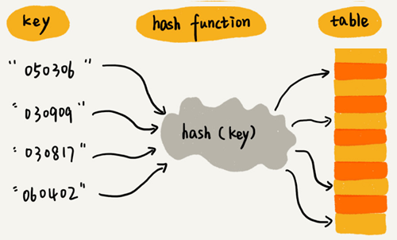

# 散列表

散列表来源于数组，它借助散列函数对数组这种数据结构进行扩展，利用的是数组支持按照下标随机访问元素的特性。散列表两个核心问题是散列函数设计和散列冲突解决。

- 散列冲突有两种常用的解决方法，开放寻址法和链表法。
- 散列函数设计的好坏决定了散列冲突的概率，也就决定散列表的性能。

散列表利用了数组按照下标随机访问的时候时间复杂度是 `O(1)` 的特性。通过散列函数把元素的键值映射为下标，然后将数据存储在数组中对应下标的位置。当按照键值查询元素时，用同样的散列函数，将键值转化数组下标，从对应的数组下标的位置取数据。

## 散列函数

散列函数，可以定义成 `hash(key)`，其中 `key` 表示元素的键值，`hash(key)` 的值表示经过散列函数计算得到的散列值。

散列函数设计的三点基本要求：

- 散列函数计算得到的散列值是一个非负整数
- 如果 `key1 = key2`，那 `hash(key1) == hash(key2)`
- 如果 `key1 ≠ key2`，那 `hash(key1) ≠ hash(key2)`

几乎无法找到一个完美的无冲突的散列函数，即便像业界著名的 [MD5](https://zh.wikipedia.org/wiki/MD5)、[SHA](https://zh.wikipedia.org/wiki/SHA家族)、[CRC](https://zh.wikipedia.org/wiki/循環冗餘校驗) 等哈希算法，也无法完全避免这种散列冲突。而且，因为数组的存储空间有限，也会加大散列冲突的概率。针对散列冲突问题，需要通过其他途径来解决。

## 解决散列冲突问题的两种方法

常用的散列冲突解决方法有两类，开放寻址法（open addressing）和链表法（chaining）。

### 开放寻址法

开放寻址法的核心思想是，如果出现了散列冲突，就重新探测一个空闲位置，将其插入。

探测新的位置的方法有线性探测（Linear Probing）、二次探测（Quadratic probing）和双重散列（Double hashing）。

#### 线性探测

往散列表中插入数据时，如果某个数据经过散列函数散列之后，存储位置已经被占用了，就从当前位置开始，依次往后查找，看是否有空闲位置，直到找到为止。

下图黄色的色块表示空闲位置，橙色的色块表示已经存储了数据：

图中散列表的大小为 10，在元素 `x` 插入散列表之前，已经 6 个元素插入到散列表中。`x` 经过 Hash 算法之后，被散列到位置下标为 7 的位置，但是这个位置已经有数据了，所以就产生了冲突。于是顺序地往后一个一个找，遍历到尾部都没有找到空闲的位置，于是我们再从表头开始找，直到找到空闲位置 2，于是将其插入到这个位置。

在散列表中查找元素，会先通过散列函数求出要查找元素的键值对应的散列值，然后比较数组中下标为散列值的元素和要查找的元素。如果相等，则说明就是我们要找的元素；否则就顺序往后依次查找。如果遍历到数组中的空闲位置，还没有找到，就说明要查找的元素并没有在散列表中。

使用线性探测法解决冲突的散列表，对于删除操作，会将被删除的元素特殊标记为 `deleted`。当线性探测查找的时候，遇到标记为 `deleted` 的空间，并不是停下来，而是继续往下探测。

**线性探测法存在的问题：**

当散列表中插入的数据越来越多时，散列冲突发生的可能性越来越大，空闲位置越来越少，线性探测的时间越来越久。极端情况下，可能需要探测整个散列表，所以最坏情况下的时间复杂度为 `O(n)`。同理，在删除和查找时，也有可能会线性探测整张散列表，才能找到要查找或者删除的数据。

