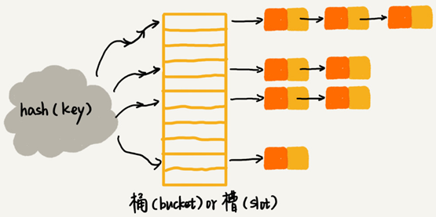

# 散列表

散列表来源于数组，它借助散列函数对数组这种数据结构进行扩展，利用的是数组支持按照下标随机访问元素的特性。散列表两个核心问题是散列函数设计和散列冲突解决。

- 散列冲突有两种常用的解决方法，开放寻址法和链表法。
- 散列函数设计的好坏决定了散列冲突的概率，也就决定散列表的性能。

散列表利用了数组按照下标随机访问的时候时间复杂度是 `O(1)` 的特性。通过散列函数把元素的键值映射为下标，然后将数据存储在数组中对应下标的位置。当按照键值查询元素时，用同样的散列函数，将键值转化数组下标，从对应的数组下标的位置取数据。

## 散列函数

散列函数，可以定义成 `hash(key)`，其中 `key` 表示元素的键值，`hash(key)` 的值表示经过散列函数计算得到的散列值。

散列函数设计的三点基本要求：

- 散列函数计算得到的散列值是一个非负整数
- 如果 `key1 = key2`，那 `hash(key1) == hash(key2)`
- 如果 `key1 ≠ key2`，那 `hash(key1) ≠ hash(key2)`

几乎无法找到一个完美的无冲突的散列函数，即便像业界著名的 [MD5](https://zh.wikipedia.org/wiki/MD5)、[SHA](https://zh.wikipedia.org/wiki/SHA家族)、[CRC](https://zh.wikipedia.org/wiki/循環冗餘校驗) 等哈希算法，也无法完全避免这种散列冲突。而且，因为数组的存储空间有限，也会加大散列冲突的概率。针对散列冲突问题，需要通过其他途径来解决。

## 解决散列冲突问题

常用的散列冲突解决方法有两类，开放寻址法（open addressing）和链表法（chaining）。

### 开放寻址法

开放寻址法的核心思想是，如果出现了散列冲突，就重新探测一个空闲位置，将其插入。

**优点：**

散列表中的数据都存储在数组中，可以有效地利用 CPU 缓存加快查询速度，序列化起来比较简单。

**缺点：**

- 删除数据的时候需要特殊标记已经删除掉的数据。
- 所有的数据都存储在一个数组中，比起链表法来说，冲突的代价更高。
- 使用开放寻址法解决冲突的散列表，装载因子的上限不能太大。
- 相比链表法更浪费内存空间。

**适用场景：**

当数据量比较小、装载因子小的时候，适合采用开放寻址法。

探测新的位置的方法有线性探测（Linear Probing）、二次探测（Quadratic probing）和双重散列（Double hashing）。

#### 线性探测

往散列表中插入数据时，如果某个数据经过散列函数散列之后，存储位置已经被占用了，就从当前位置开始，依次往后查找，看是否有空闲位置，直到找到为止。

下图黄色的色块表示空闲位置，橙色的色块表示已经存储了数据：

图中散列表的大小为 10，在元素 `x` 插入散列表之前，已经 6 个元素插入到散列表中。`x` 经过 Hash 算法之后，被散列到位置下标为 7 的位置，但是这个位置已经有数据了，所以就产生了冲突。于是顺序地往后一个一个找，遍历到尾部都没有找到空闲的位置，于是我们再从表头开始找，直到找到空闲位置 2，于是将其插入到这个位置。

在散列表中查找元素，会先通过散列函数求出要查找元素的键值对应的散列值，然后比较数组中下标为散列值的元素和要查找的元素。如果相等，则说明就是我们要找的元素；否则就顺序往后依次查找。如果遍历到数组中的空闲位置，还没有找到，就说明要查找的元素并没有在散列表中。

使用线性探测法解决冲突的散列表，对于删除操作，会将被删除的元素特殊标记为 `deleted`。当线性探测查找的时候，遇到标记为 `deleted` 的空间，并不是停下来，而是继续往下探测。

**线性探测法存在的问题：**

当散列表中插入的数据越来越多时，散列冲突发生的可能性越来越大，空闲位置越来越少，线性探测的时间越来越久。极端情况下，可能需要探测整个散列表，所以最坏情况下的时间复杂度为 `O(n)`。同理，在删除和查找时，也有可能会线性探测整张散列表，才能找到要查找或者删除的数据。

#### 二次探测

线性探测每次探测的步长是 1，它探测的下标序列是 `hash(key)+0`，`hash(key)+1`，`hash(key)+2`……而二次探测探测的步长就变成了原来的“二次方”，也就是说，它探测的下标序列就是 `hash(key)+0`，`hash(key)+1^2`，`hash(key)+2^2`……

#### 双重散列

并不只用一个散列函数，而是同时使用一组散列函数 `hash1(key)`，`hash2(key)`，`hash3(key)`……先用第一个散列函数，如果计算得到的存储位置已经被占用，再用第二个散列函数，依次类推，直到找到空闲的存储位置。

### 链表法

在散列表中，每个“桶（bucket）”或者“槽（slot）”会对应一条链表，所有散列值相同的元素我们都放到相同槽位对应的链表中。

插入的时候只需要通过散列函数计算出对应的散列槽位，将其插入到对应链表中即可，所以插入的时间复杂度是 `O(1)`。当查找、删除一个元素时，同样通过散列函数计算出对应的槽，然后遍历链表查找或者删除。

查找或删除操作的时间复杂度跟链表的长度 `k` 成正比，即 `O(k)`。对于散列比较均匀的散列函数来说，理论上讲，`k=n/m`，其中 `n` 表示散列中数据的个数，`m` 表示散列表中“槽”的个数。

**优点：**

- 对内存的利用率比开放寻址法要高，链表结点可以在需要的时候再创建。
- 对大装载因子的容忍度更高：开放寻址法只能适用装载因子小于 1 的情况。对于链表法来说，只要散列函数的值随机均匀，即便装载因子变成 10，也只是是链表的长度变长了而已。

**缺点：**

- 链表要存储指针对于比较小的对象的存储，是比较消耗内存的，还有可能会让内存的消耗翻倍。
- 链表中的结点是零散分布在内存中的，不是连续的，对 CPU 缓存不友好对于执行效率有一定的影响。

如果存储的是大对象，即存储的对象的大小远远大于一个指针的大小（4 个字节或者 8 个字节），那链表中指针的内存消耗在大对象面前可以忽略了。

链表法中的链表可以改造为跳表、红黑树等其他的动态数据结构，这样即便所有的数据都散列到同一个桶内，那最终退化成的散列表的查找时间也只不过是 `O(logn)`。

**适用场景：**

基于链表的散列冲突处理方法比较适合存储大对象、大数据量的散列表。

## 设计良好的散列函数

散列函数设计的好坏，决定了散列表冲突的概率大小，也直接决定了散列表的性能。

- 散列函数的设计不能太复杂。过于复杂的散列函数，势必会消耗很多计算时间，也就间接的影响到散列表的性能。
- 散列函数生成的值要尽可能随机并且均匀分布，这样才能避免或者最小化散列冲突，而且即便出现冲突，散列到每个槽里的数据也会比较平均，不会出现某个槽内数据特别多的情况。

散列函数的设计方法还有直接寻址法、平方取中法、折叠法、随机数法等，根据实际情况设计即可。

## 装载因子过大时需要进行动态扩容

装载因子的计算公式：

**散列表的装载因子 = 填入表中的元素个数 / 散列表的长度**

装载因子越大说明散列表中的元素越多，空闲位置越少，散列冲突的概率就越大。不仅插入数据的过程要多次寻址或者拉很长的链，查找的过程也会因此变得很慢。

对于动态散列表来说，数据集合是频繁变动的，事先无法预估将要加入的数据个数。随着数据慢慢加入，装载因子就会慢慢变大。当装载因子大到一定程度之后，散列冲突就会变得不可接受。

针对散列表的扩容，数据搬移操作相对数组要复杂很多。散列表的大小变了，数据的存储位置也变了需要通过散列函数重新计算每个数据的存储位置。

下图中，21 这个元素原来存储在下标为 0 的位置，搬移到新的散列表中，存储在下标为 7 的位置。

插入一个数据，最好情况下，不需要扩容，最好时间复杂度是 `O(1)`。最坏情况下，启动扩容需要重新申请内存空间，重新计算哈希位置，并且搬移数据，时间复杂度是 `O(n)`。用摊还分析法，均摊情况下，时间复杂度接近最好情况，就是 `O(1)`。

对于动态散列表，随着数据的删除，散列表中的数据会越来越少，空闲空间会越来越多。如果对空间消耗非常敏感，可以在装载因子小于某个值之后，启动动态缩容。

### 均摊插入避免低效扩容

当装载因子已经到达阈值，需要先进行扩容，再插入数据。这个时候，插入数据就会变得很慢，甚至会无法接受。为了解决一次性扩容耗时过多的情况，可以将扩容操作穿插在插入操作的过程中，分批完成。当装载因子触达阈值之后，只申请新空间，但并不将老的数据搬移到新散列表中。

当有新数据要插入时，将新数据插入新散列表中，并且从老的散列表中拿出一个数据放入到新散列表。每次插入一个数据到散列表，都重复上面的过程。经过多次插入操作之后，老的散列表中的数据就一点一点全部搬移到新散列表中了。这样就没有了集中的一次性数据搬移，而是分摊到了每一次插入操作上。

对于查询操作，先从新散列表中查找，如果没有找到，再去老的散列表中查找。通过这样均摊的方法，将一次性扩容的代价，均摊到多次插入操作中，就避免了一次性扩容耗时过多的情况。这种实现方式，任何情况下，插入一个数据的时间复杂度都是 `O(1)`。

