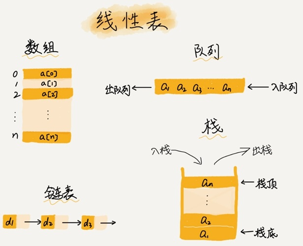
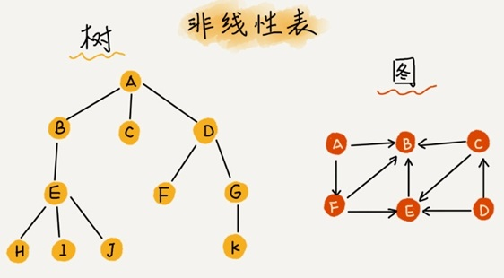
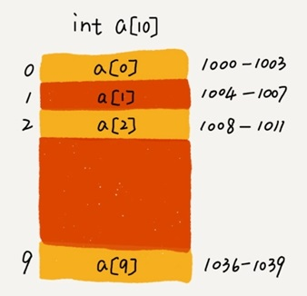
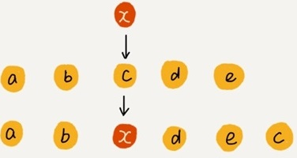

# 数组

数组是一种最基础的数据结构，在大部分编程语言中，数组都是从 0 开始编号的。

## 线性表与非线性表

线性表（Linear List），就是数据排成像一条线一样的结构。每个线性表上的数据最多只有前和后两个方向，包括数组，链表、队列、栈等。

数组（Array）是一种线性表数据结构。它用一组连续的内存空间，来存储一组具有相同类型的数据。



非线性表，数据之间并不是简单的前后关系，有二叉树、堆、图等，如下图：



## 数组随机访问

数组使用了连续的内存空间和相同类型的数据。使得它可以“随机访问”，根据下标随机访问的时间复杂度为 `O(1)`。但同时也让数组的删除、插入等操作变得非常低效，为了保证连续性，就需要做大量的数据搬移工作。

假设计算机给数组 a[10]，分配了一块连续内存空间 1000～1039，其中，内存块的首地址为 base_address = 1000：



当计算机需要随机访问数组中的某个元素时，它会首先通过下面的寻址公式，计算出该元素存储的内存地址：

```
a[i]_address = base_address + i * data_type_size  //@ data_type_size 表示数组中每个元素的大小
```

## 数组查找

排好序的数组用二分查找，时间复杂度是 `O(logn)`。

顺序查找，最好时间复杂度为 `O(1)`，最差时间复杂度为 `O(n)`，平均时间复杂度为 `O(n)`。

## 数组的低效操作

### 插入操作

假设数组的长度为 n，如果将一个数据插入到数组中的第 `k` 个位置。为了把第 `k` 个位置腾出来给新来的数据，需要将第 `k～n` 这部分的元素都顺序地往后挪一位。

如果在数组的末尾插入元素，那就不需要移动数据了，这时的时间复杂度为 `O(1)`。但如果在数组的开头插入元素，那所有的数据都需要依次往后移动一位，所以最坏时间复杂度是 `O(n)`。 因为我们在每个位置插入元素的概率是一样的，所以平均情况时间复杂度为`O(n)`。

如果数组中存储的数据并没有任何规律，数组只是被当作一个存储数据的集合。可以直接将第 k 位的数据搬移到数组元素的最后，把新的元素直接放入第 k 个位置：

现在需要将元素 `x` 插入到第 3 个位置。我们只需要将 `c` 放入到 a[5]，将 a[2] 赋值为 `x` 即可：



利用这种处理技巧，在特定场景下，在第 k 个位置插入一个元素的时间复杂度就会降为 `O(1)`。

### 删除操作

如果我们要删除第 `k` 个位置的数据，为了内存的连续性，也需要搬移数据，不然中间就会出现空洞，内存就不连续了。

如果删除数组末尾的数据，则最好情况时间复杂度为 `O(1)`；如果删除开头的数据，则最坏情况时间复杂度为 `O(n)`；平均情况时间复杂度也为 `O(n)`。

在某些特殊场景下，我们并不一定非得追求数组中数据的连续性。可以将多次删除操作集中在一起执行，比如数组 `a[10]` 中存储了 8 个元素：`a，b，c，d，e，f，g，h`。要依次删除 `a，b，c` 三个元素：


为了避免 `d，e，f，g，h` 这几个数据会被搬移三次，可以先记录下已经删除的数据。每次的删除操作并不是真正地搬移数据，只是记录数据已经被删除。当数组没有更多空间存储数据时，再触发执行一次真正的删除操作。

## 警惕数组的访问越界

注意下面越界的情况：

```
int main(int argc, char* argv[]){
    int i = 0;
    int arr[3] = {0};
    for(; i<=3; i++) //@ a[3] 被定位到某块不属于数组的内存地址上，而这个地址正好是存储变量 i 的内存地址
    {
        arr[i] = 0;
        printf("hello world\n");
    }
    return 0;
}
```

## 容器 vs 数组

数组本身在定义的时候需要预先指定大小，因为需要分配连续的内存空间。如果我们申请了大小为 10 的数组，当第 11 个数据需要存储到数组中时，我们就需要重新分配一块更大的空间，将原来的数据复制过去，然后再将新的数据插入。

C++ STL 中的 vector 能够支持动态扩容。

## 为什么数组要从 0 开始编号?

从数组存储的内存模型上来看，“下标”最确切的定义应该是“偏移（offset）”。

从 0 开始编号，数组 `a[k]` 的内存寻址公式为：

```
a[k]_address = base_address + k * type_size
```

从 1 开始编号，数组 `a[k]` 的内存寻址公式为：

```
a[k]_address = base_address + (k-1)*type_size
```

对比两个公式，从 1 开始编号，每次随机访问数组元素都多了一次减法运算，对于 CPU 来说，就是多了一次减法指令。

## 二维数组的内存寻址公式

对于 m * n 的数组，`a[i][j] (i<m,j<n)`的地址为：

```
address = base_address + (i*n+j)*type_size
```


