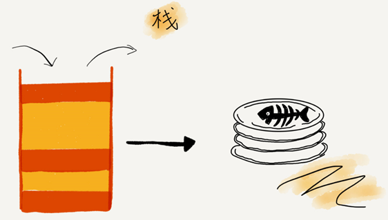
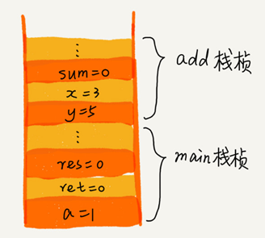

# 栈

先进后出，后进先出，就是典型的“栈”结构：



从栈的操作特性上来看，栈是一种“操作受限”的线性表，只允许在一端插入和删除数据。

当某个数据集合只涉及在一端插入和删除数据，并且满足后进先出、先进后出的特性，就应该首选“栈”这种数据结构。

栈主要包含两个操作，入栈和出栈，也就是在栈顶插入一个数据和从栈顶删除一个数据。

栈既可以用数组来实现，也可以用链表来实现。用数组实现的栈，我们叫作顺序栈，用链表实现的栈，我们叫作链式栈。

## 函数调用栈

操作系统给每个线程分配了一块独立的内存空间，这块内存被组织成“栈”这种结构, 用来存储函数调用时的临时变量。每进入一个函数，就会将临时变量作为一个栈帧入栈，当被调用函数执行完成，返回之后，将这个函数对应的栈帧出栈：

```
int main() {
   int a = 1; 
   int ret = 0;
   int res = 0;
   ret = add(3, 5);
   res = a + ret;
   printf("%d", res);
   reuturn 0;
}

int add(int x, int y) {
   int sum = 0;
   sum = x + y;
   return sum;
}
```

下图表示在执行到 `add()` 函数时，函数调用栈出栈、入栈的的情况：




