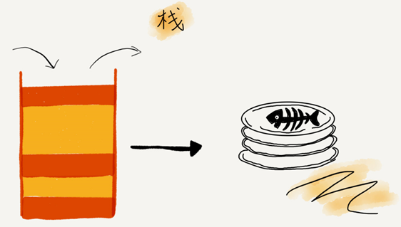
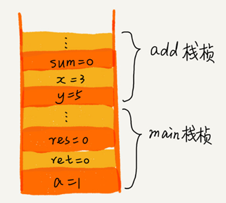

.. toctree::
   :maxdepth: 2
   :glob:

栈
==

先进后出，后进先出，就是典型的“栈”结构：

|image1|

从栈的操作特性上来看，栈是一种“操作受限”的线性表，只允许在一端插入和删除数据。

当某个数据集合只涉及在一端插入和删除数据，并且满足后进先出、先进后出的特性，就应该首选“栈”这种数据结构。

栈主要包含两个操作，入栈和出栈，也就是在栈顶插入一个数据和从栈顶删除一个数据。

栈既可以用数组来实现，也可以用链表来实现。用数组实现的栈，我们叫作顺序栈，用链表实现的栈，我们叫作链式栈。

函数调用栈
----------

操作系统给每个线程分配了一块独立的内存空间，这块内存被组织成“栈”这种结构,
用来存储函数调用时的临时变量。每进入一个函数，就会将临时变量作为一个栈帧入栈，当被调用函数执行完成，返回之后，将这个函数对应的栈帧出栈：

::

   int main() {
      int a = 1; 
      int ret = 0;
      int res = 0;
      ret = add(3, 5);
      res = a + ret;
      printf("%d", res);
      reuturn 0;
   }

   int add(int x, int y) {
      int sum = 0;
      sum = x + y;
      return sum;
   }

下图表示在执行到 ``add()`` 函数时，函数调用栈出栈、入栈的的情况：

|image2|

