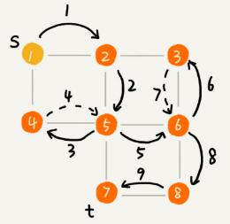

# 深度和广度优先搜索

## “搜索”算法

深度优先搜索算法和广度优先搜索算法都是基于“图”这种数据结构。

图上的搜索算法就是，在图中找出从一个顶点出发，到另一个顶点的路径。图上的搜索算法有深度优先、广度优先搜索算法，和 `A*`、`IDA*` 等启发式搜索算法。广度优先搜索和深度优先搜索是图上的两种最常用、最基本的搜索算法，仅适用于状态空间不大的搜索。它们比 `A*`、`IDA*`  等启发式搜索算法要简单粗暴，没有什么优化，所以也叫作暴力搜索算法。

广度优先搜索，采用地毯式层层推进，从起始顶点开始，依次往外遍历。广度优先搜索需要借助队列来实现，遍历得到的路径就是起始顶点到终止顶点的最短路径。

深度优先搜索，采用回溯思想，适合用递归或栈来实现。遍历得到的路径并不是最短路径。深度优先和广度优先搜索的时间复杂度都是 `O(E)`，空间复杂度都是 `O(V)`。其中 `E` 代表边，`O` 代表顶点。

## 广度优先搜索（BFS）

广度优先搜索（Breadth-First-Search），简称 BFS。它是一种“地毯式”层层推进的搜索策略，即先查找离起始顶点最近的，然后是次近的，依次往外搜索：

- `bfs()` 函数用于搜索一条从 `s` 到 `t` 的最短路径，其中 `s` 表示起始顶点，`t` 表示终止顶点。

- `visited` 是用来记录已经被访问的顶点，用来避免顶点被重复访问。如果顶点 `q` 被访问，那相应的 `visited[q]` 会被设置为 `true`。
- `queue` 是一个队列，用来存储已经被访问、但相连的顶点还没有被访问的顶点。
- `prev` 用来记录搜索路径。`prev[w]` 存储的是，顶点 `w` 是从哪个前驱顶点遍历过来的。

广度优先搜索过程分解图：

最坏情况下，终止顶点 `t` 离起始顶点 `s` 很远，需要遍历完整个图才能找到。这个时候，每个顶点都要进出一遍队列，每个边也都会被访问一次。

假设顶点的个数为 `V`，边的个数为 `E`，那么广度优先搜索的时间复杂度是 `O(V+E)`。对于连通图（所有顶点都是连通的）来说，`E >= V-1`，所以，广度优先搜索的时间复杂度可以简写为 `O(E)`。

广度优先搜索的空间消耗主要在辅助变量 `visited` 数组、`queue` 队列、`prev` 数组上。这三个存储空间的大小都不会超过顶点的个数，所以空间复杂度是 `O(V)`。

## 深度优先搜索（DFS）

深度优先搜索（Depth-First-Search），简称 DFS。

最直观的例子就是“走迷宫”。假设你站在迷宫的某个岔路口，然后想找到出口。你随意选择一个岔路口来走，走着走着发现走不通的时候，你就回退到上一个岔路口，重新选择一条路继续走，直到最终找到出口。这种走法就是一种深度优先搜索策略。

下图中，搜索的起始顶点是 `s`，终止顶点是 `t`，希望在图中寻找一条从顶点 `s` 到顶点 `t` 的路径。如果映射到迷宫那个例子，`s` 就是你起始所在的位置，`t` 就是出口。

下图标记了递归算法的搜索的过程，里面实线箭头表示遍历，虚线箭头表示回退。但深度优先搜索最先找出来的路径，并不是顶点 `s` 到顶点 `t` 的最短路径。

深度优先搜索用的是回溯思想，回溯思想非常适合用递归来实现。

深度优先搜索算法的时间复杂度是 `O(E)`，`E` 表示边的个数。因为每条边最多会被访问两次，一次是遍历，一次是回退。

深度优先搜索算法的消耗内存主要是 `visited`、`prev` 数组和递归调用栈。`visited`、`prev` 数组的大小跟顶点的个数 `V` 成正比，递归调用栈的最大深度不会超过顶点的个数，所以总的空间复杂度是 `O(V)`。

