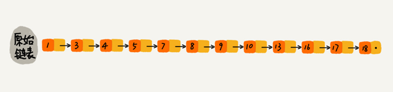
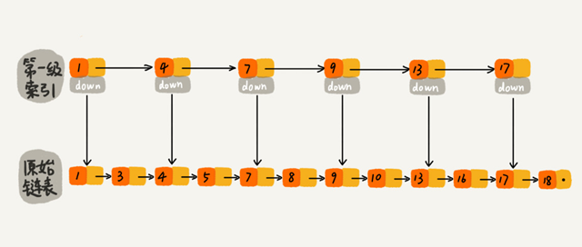
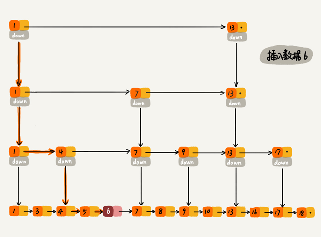

# 跳表

**跳表=链表+多级索引**

跳表使用空间换时间的设计思路，通过构建多级索引来提高查询的效率，实现了基于链表的“二分查找”。跳表是一种动态数据结构，支持快速的插入、删除、查找操作，时间复杂度都是 `O(logn)`。

对于一个单链表，即便链表中存储的数据是有序的，如果要查找某个数据，也只能从头到尾遍历，时间复杂度是 `O(n)`。

对链表建立一级“索引”，每两个结点提取一个结点到上一级，把抽出来的那一级叫作索引或索引层。图中的 `down` 表示 `down` 指针，指向下一级结点。

这样就可以先在索引层遍历，然后通过索引层结点的 down 指针，下降到原始链表这一层，继续遍历。

比如要查找 16，当在索引层遍历到13 时，发现索引层下一个节点是 17 大于目标 16，则可从 13 的 `down` 指针下降到原始链表继续遍历。这样只需要再遍历 2 个结点，就可以找到值等于 16  的这个结点了。原来查找 16，需要遍历 10 个结点，加入一层索引后只需要遍历 7 个结点。

增加索引层数将会进一步较少遍历的节点个数：

下图是一个包含 64 个结点的链表，建立五级索引，查找 62 只需要遍历 11 个结点。当链表的长度 n 比较大时，比如 1000、10000 的时候，在构建多级索引之后，查找效率的提升就会非常明显。

## 跳表的时间复杂度分析

一个链表里有 `n` 个结点，每两个结点会抽出一个结点作为上一级索引的结点，那第一级索引的结点个数大约就是 `n/2`，第二级索引的结点个数大约就是 `n/4`，第三级索引的结点个数大约就是 `n/8`，依次类推，也就是说，第 k 级索引的结点个数是第 `k-1` 级索引的结点个数的 `1/2`，那第 `k` 级索引结点的个数就是 `n/(2^k)`。

假设索引有 `h` 级，最高级的索引有 2 个结点，则 `n/(2^h)=2`n，即  `h=logn -1 `。加上原始链表这一层，整个跳表的高度就是 `logn` 。在跳表中查询某个数据的时候，如果每一层都要遍历 `m` 个结点，那在跳表中查询一个数据的时间复杂度就是 `O(m*logn)`。

按照每两个结点提取一个结点到上一级建立索引这种结构，每一级索引都最多只需要遍历 3 个结点，那么 `m=3`。假设要查找的数据是 `x`，在第 `k` 级索引中遍历到 `y` 结点之后，发现 `x` 大于 `y`，小于后面的结点 `z`，所以通过 `y` 的 `down` 指针，从第 `k` 级索引下降到第 `k-1` 级索引。在第 `k-1` 级索引中，`y` 和 `z` 之间只有 3 个结点（包含 `y` 和 z），所以在 `k-1` 级索引中最多只需要遍历 3 个结点，依次类推，每一级索引都最多只需要遍历 3 个结点。

所以在跳表中查询任意数据的时间复杂度就是 `O(logn)`。

## 跳表的空间复杂度分析

假设原始链表大小为 `n`，那第一级索引大约有 `n/2` 个结点，第二级索引大约有 `n/4` 个结点，以此类推，每上升一级就减少一半，直到剩下 `2` 个结点。每层索引的节点数为：
$$
\frac{\mathrm{n}}{2}, \frac{\mathrm{n}}{4}, \frac{\mathrm{n}}{8}, \ldots, 8,4,2
$$
这几级索引的结点总和就是 `n−2`。所以跳表的空间复杂度是 `O(n)`。

将包含 n 个结点的单链表构造成跳表，需要额外再用接近 n 个结点的存储空间。

如果每三个结点或五个结点，抽一个结点到上级索引：

每3个节点抽一个，每层索引的节点数为：
$$
\frac{\mathrm{n}}{3}, \frac{\mathrm{n}}{9}, \frac{\mathrm{n}}{27}, \ldots, 9,3,1
$$
总的索引结点个数为 `n/2`。空间复杂度依然是 `O(n)`，但比每两个结点抽一个结点的索引构建方法，减少了一半的索引结点存储空间。

在实际的软件开发中，原始链表中存储的有可能是很大的对象，而索引结点只需要存储关键值和几个指针，并不需要存储对象，所以当对象比索引结点大很多时，那索引占用的额外空间就可以忽略了。

## 跳表动态的插入和删除

跳表插入、删除操作的时间复杂度是 `O(logn)`。

对于删除操作，如果这个结点在索引中也有出现，删除原始链表中的结点之后还要删除对应的索引。

查找要删除的结点的时候，一定要获取前驱结点。

## 跳表索引动态更新

不停地往跳表中插入数据时，如果不更新索引，就有可能出现某 2 个索引结点之间数据非常多的情况。极端情况下，跳表还会退化成单链表。

作为一种动态数据结构，需要某种手段来维护索引与原始链表大小之间的平衡：

- 如果链表中结点多了，索引结点就相应地增加一些，避免复杂度退化，以及查找、插入、删除操作性能下降。
- 往跳表中插入数据的时候，可以同时将这个数据插入到部分索引层中。通过一个随机函数，来决定将这个结点插入到哪几级索引中，比如随机函数生成了值 `K`，就将这个结点添加到第一级到第 `K` 级这 `K` 级索引中。

往跳表中插入数据的时候，可以同时将这个数据插入到部分索引层中。通过一个随机函数，来决定将这个结点插入到哪几级索引中，比如随机函数生成了值 `K`，就将这个结点添加到第一级到第 `K` 级这 `K` 级索引中。

## Redis 用跳表实现有序集合

Redis 中的有序集合是通过跳表来实现的，严格点讲，其实还用到了散列表。

Redis 中的有序集合支持的核心操作主要有：

- 插入一个数据
- 删除一个数据
- 查找一个数据
- 按照区间查找数据（比如查找值在 [100, 356] 之间的数据）
- 迭代输出有序序列

其中，插入、删除、查找以及迭代输出有序序列这几个操作，红黑树也可以完成，时间复杂度跟跳表是一样的。但是，按照区间来查找数据这个操作，红黑树的效率没有跳表高。

对于按照区间查找数据这个操作，跳表可以做到 `O(logn)` 的时间复杂度定位区间的起点，然后在原始链表中顺序往后遍历就可以了。这样做非常高效。

跳表相对红黑树而言代码更容易实现，简单就意味着可读性好，不容易出错。还有，跳表更加灵活，它可以通过改变索引构建策略，有效平衡执行效率和内存消耗。

