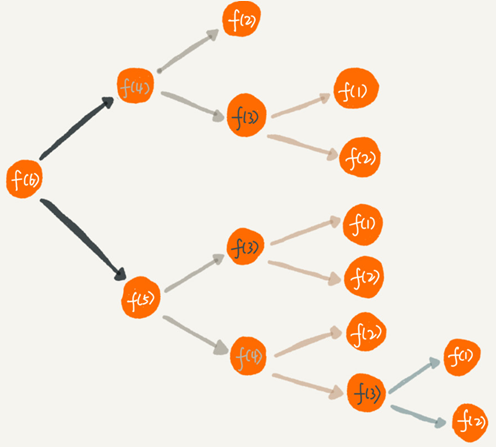

# 递归

一个生活中用到递归的例子：

```
周末你带着女朋友去电影院看电影，女朋友问你，咱们现在坐在第几排啊？电影院里面太黑了，看不清，没法数，现在你怎么办？于是你就问前面一排的人他是第几排，你想只要在他的数字上加一，就知道自己在哪一排了。但是，前面的人也看不清啊，所以他也问他前面的人。就这样一排一排往前问，直到问到第一排的人，说我在第一排，然后再这样一排一排再把数字传回来。直到你前面的人告诉你他在哪一排，于是你就知道答案了。
```

这就是一个非常标准的递归求解问题的分解过程，去的过程叫“递”，回来的过程叫“归”。

## 递归需要满足的三个条件

满足三个条件的问题可以用递归来解决：

- **一个问题的解可以分解为几个子问题的解**

子问题就是数据规模更小的问题。比如，前面讲的电影院的例子，你要知道，“自己在哪一排”的问题，可以分解为“前一排的人在哪一排”这样一个子问题。

- **这个问题与分解之后的子问题，除了数据规模不同，求解思路完全一样**

比如电影院那个例子，求解“自己在哪一排”的思路，和前面一排人求解“自己在哪一排”的思路，是一模一样的。

- **存在递归终止条件**

把问题分解为子问题，把子问题再分解为子子问题，一层一层分解下去，不能存在无限循环，这就需要有终止条件。

还是电影院的例子，第一排的人不需要再继续询问任何人，就知道自己在哪一排，这就是递归的终止条件。

## 如何编写递归代码

写递归代码最关键的是写出递推公式，找到终止条件。

写递归代码的关键就是找到如何将大问题分解为小问题的规律，并且基于此写出递推公式，然后再推敲终止条件，最后将递推公式和终止条件翻译成代码。

只要遇到递归，就把它抽象成一个递推公式，不用想一层层的调用关系，不要试图用人脑去分解递归的每个步骤。

假如这里有 n 个台阶，每次你可以跨 1 个台阶或者 2 个台阶，请问走这 n 个台阶有多少种走法？如果有 7 个台阶，你可以 2，2，2，1 这样子上去，也可以 1，2，1，1，2 这样子上去，总之走法有很多，那如何用编程求得总共有多少种走法呢？

递归终止条件就是 f(1)=1，f(2)=2：

```
int f(int n) {
  if (n == 1) return 1;
  if (n == 2) return 2;
  return f(n-1) + f(n-2);
}
```

## 递归代码要警惕堆栈溢出

函数调用会使用栈来保存临时变量。每调用一个函数，都会将临时变量封装为栈帧压入内存栈，等函数执行完成返回时，才出栈。如果递归求解的数据规模很大，调用层次很深，一直压入栈，就会有堆栈溢出的风险。

如何避免出现堆栈溢出呢？方法之一是在代码中限制递归调用的最大深度，递归调用超过一定深度（比如 1000）之后，就直接返回报错。

## 递归代码要警惕重复计算

对于上面的走台阶问题，递归代码的例子把整个递归过程分解如下：



为了避免重复计算，我们可以通过一个数据结构（比如散列表）来保存已经求解过的 f(k)。当递归调用到 f(k) 时，先看下是否已经求解过了。如果是，则直接从散列表中取值返回，不需要重复计算。

## 将递归代码改写为非递归代码

递归代码的表达力很强，写起来非常简洁，但是空间复杂度高、有堆栈溢出的风险、存在重复计算、过多的函数调用会耗时较多等问题。所以，应当根据实际情况尽量把递归代码改写为非递归代码。

例如走台阶的问题可以改写为：

```
int f(int n) {
  if (n == 1) return 1;
  if (n == 2) return 2;

  int ret = 0;
  int pre = 2;
  int prepre = 1;
  for (int i = 3; i <= n; ++i) {
    ret = pre + prepre;
    prepre = pre;
    pre = ret;
  }
  return ret;
}
```


递归代码虽然简洁高效，但是，递归代码也有很多弊端。比如，堆栈溢出、重复计算、函数调用耗时多、空间复杂度高等，所以，在编写递归代码的时候，一定要控制好这些副作用。