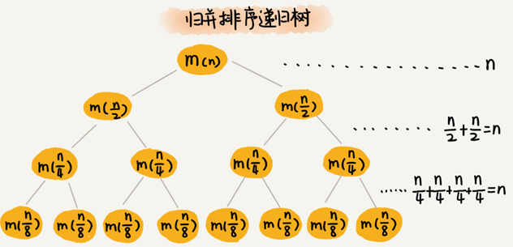
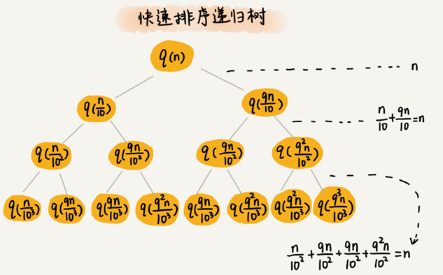
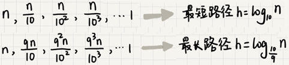
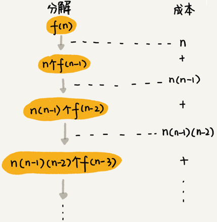

# 递归树

递归的思想就是，将大问题分解为小问题来求解，然后再将小问题分解为小小问题。这样一层一层地分解，直到问题的数据规模被分解得足够小，不用继续递归分解为止。

如果把这个一层一层的分解过程画成图，它其实就是一棵树，这棵树就叫**递归树**。

下面是一棵斐波那契数列的递归树，节点里的数字表示数据的规模，一个节点的求解可以分解为左右子节点两个问题的求解。


## 递归树分析归并排序递归代码的时间复杂度

归并排序每次会将数据规模一分为二，画成递归树，就是下面这个样子：



归并排序递归树是一棵满二叉树，满二叉树的高度大约是 `logn`，归并排序递归实现的时间复杂度就是 `O(nlogn)` 。

## 分析快速排序的时间复杂度

快速排序在最好情况下，每次分区都能一分为二，很容易就能推导出时间复杂度是 `O(nlogn)` 。

假设平均情况下，每次分区之后两个分区的大小比例为 `1:k`。当 `k=9` 时，用递归树来分析这种情况下快速排序的平均情况时间复杂度：



快速排序的过程中，每次分区都要遍历待分区区间的所有数据，所以，每一层分区操作所遍历的数据的个数之和就是 `n`。假设递归树的高度 `h`，时间复杂度就是 `O(h∗n)`。

每次分区并不是均匀地一分为二，递归树并不是满二叉树。快速排序结束的条件就是待排序的小区间，大小为 1，也就是说叶子节点里的数据规模是 1。

从根节点 `n` 到叶子节点 1，递归树中最短的一个路径每次都乘以 `1/10`，最长的一个路径每次都乘以 `9/10` ：



只要 `k` 的值不随  `n` 变化，是一个事先确定的常量，那快排的时间复杂度就是 `O(nlogn)`。所以，从概率论的角度来说，快排的平均时间复杂度就是`O(nlogn)`。

## 分析斐波那契数列的时间复杂度

斐波那契数列的递推实现代码实现代码：

```
int f(int n) {
  if (n == 1) return 1;
  if (n == 2) return 2;
  return f(n-1) + f(n-2);
}
```

把上面的递归代码画成递归树，就是下面这个样子：


`f(n)` 分解为 `f(n−1)` 和 `f(n−2)`，每次数据规模都是 `−1` 或者 `−2`，叶子节点的数据规模是 1 或者 2。所以，从根节点走到叶子节点，每条路径是长短不一的。如果每次都是 `−1`，那最长路径大约就是 `n`；如果每次都是 `−2`，那最短路径大约就是 `n/2`。

每次分解之后的合并操作只需要一次加法运算，把这次加法运算的时间消耗记作 `1`。所以，从上往下，第一层的总时间消耗是 `1`，第二层的总时间消耗是 `2`，第三层的总时间消耗就是 `2^2`。依次类推，第 `k` 层的时间消耗就是 `2^(k−1)`，那整个算法的总的时间消耗就是每一层时间消耗之和。

如果路径长度都为 `n`，那这个总和就是 `2^n−1`。
$$
1+2+\cdots+2^{\mathrm{n}-1}=2^{\mathrm{n}}-1
$$
如果路径长度都是 `n/2` ，那整个算法的总的时间消耗就是 `2^(n/2)-1`。
$$
1+2+\cdots+2^{\frac{\pi}{2}-1}=2^{\frac{n}{2}}-1
$$


所以，这个算法的时间复杂度就介于 `O(2^n)` 和 `O(2^(n/2)) 之间，算法的时间复杂度是指数级的。

## 分析全排列的时间复杂度

“如何把n 个数据的所有排列都找出来”，这就是全排列的问题。比如 `1，2，3` 这样 3 个数据，有下面这几种不同的排列：

```
1, 2, 3
1, 3, 2
2, 1, 3
2, 3, 1
3, 1, 2
3, 2, 1
```

如果确定了第一位数据，就变成了求解剩下 `n−1` 个数据的排列问题。而第一位数据可以是 `n` 个数据中的任意一个，因此它的取值就有 `n`种情况。所以，“n 个数据的排列”问题，就可以分解成 `n` 个“n−1 个数据的排列”的子问题。



第一层分解有 `n` 次交换操作，第二层有 `n` 个节点，每个节点分解需要 `n−1` 次交换，所以第二层总的交换次数是 `n∗(n−1)`。第三层有 `n∗(n−1)` 个节点，每个节点分解需要 `n−2` 次交换，所以第三层总的交换次数是 `n∗(n−1)∗(n−2)`。

每一层的交换次数之和就是总的交换次数：
$$
\mathrm{n}+\mathrm{n} *(\mathrm{n}-1)+\mathrm{n} *(\mathrm{n}-1) *(\mathrm{n}-2)+\ldots+\mathrm{n} *(\mathrm{n}-1) *(\mathrm{n}-2) * \ldots * 2 * 1
$$
最后一个数 `n∗(n−1)∗(n−2)∗…∗2∗1` 等于 `n!`，而前面的 `n−1` 个数都小于最后一个数，所以，总和肯定小于 `n∗n!`，全排列的递归算法的时间复杂度在 ` O(n!)` 到 `O(n∗n!)`之间，阶乘级。


