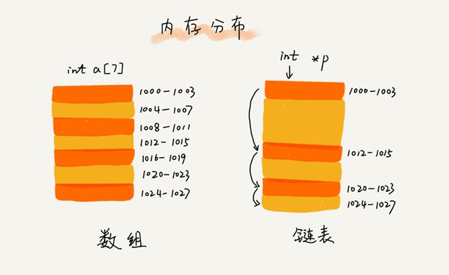

# 链表

## 空间换时间和时间换空间

**空间换时间的设计思想**：当内存空间充足的时候，为了追求代码更快的执行速度，就可以选择空间复杂度相对较高、但时间复杂度相对很低的算法或者数据结构。

**时间换空间的设计思想**：内存空间比较紧缺时，可以选择空间复杂度相对较低、但时间复杂度相对很高的算法或者数据结构，来节省内存空间。

## 链表的存储结构

数组需要一块连续的内存空间来存储，需要事先申请需要申请内存空间；而链表通过“指针”将一组零散的内存块串联起来使用，不会占用还未使用的内存空间。

## 三种最常见的链表结构

### 单链表
链表通过指针将一组零散的内存块串联在一起，内存块称为链表的“结点”。每个链表的结点除了存储数据之外，还需要记录链上的下一个结点的地址，叫作后继指针 `next`。

头结点用来记录链表的基地址，用它可以遍历得到整条链表。

尾结点指向一个空地址 `NULL`，表示这是链表上最后一个结点。

### 循环链表

循环链表跟单链表的区在尾结点指针是指向链表的头结点：

和单链表相比，循环链表的优点是从链尾到链头比较方便。

当要处理的数据具有环型结构特点时，采用循环链表实现代码会简洁很多。

