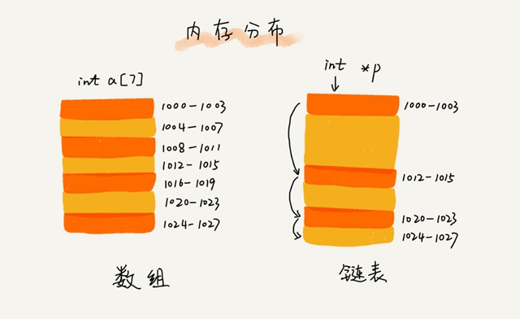
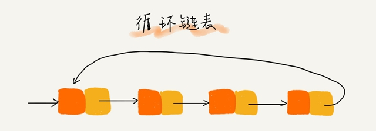
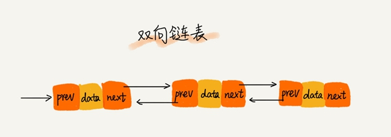
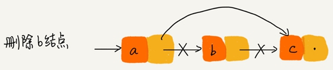
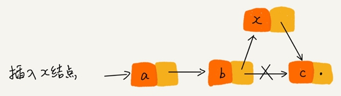

.. toctree::
   :maxdepth: 2
   :glob:

链表
====

空间换时间和时间换空间
----------------------

**空间换时间的设计思想**\ ：当内存空间充足的时候，为了追求代码更快的执行速度，就可以选择空间复杂度相对较高、但时间复杂度相对很低的算法或者数据结构。

**时间换空间的设计思想**\ ：内存空间比较紧缺时，可以选择空间复杂度相对较低、但时间复杂度相对很高的算法或者数据结构，来节省内存空间。

链表的存储结构
--------------

|image1|

数组需要一块连续的内存空间来存储，需要事先申请需要申请内存空间；而链表通过“指针”将一组零散的内存块串联起来使用，不会占用还未使用的内存空间。

三种最常见的链表结构
--------------------

单链表
~~~~~~

链表通过指针将一组零散的内存块串联在一起，内存块称为链表的“结点”。每个链表的结点除了存储数据之外，还需要记录链上的下一个结点的地址，叫作后继指针
``next``\ 。

|image2|

头结点用来记录链表的基地址，用它可以遍历得到整条链表。

尾结点指向一个空地址 ``NULL``\ ，表示这是链表上最后一个结点。

循环链表
~~~~~~~~

循环链表跟单链表的区在尾结点指针是指向链表的头结点：

|image3|

和单链表相比，循环链表的优点是从链尾到链头比较方便。

当要处理的数据具有环型结构特点时，采用循环链表实现代码会简洁很多。

双向链表
~~~~~~~~

双向链表支持两个方向，每个结点同时有后继指针 ``next``
指向后面的结点，还有一个前驱指针 ``prev`` 指向前面的结点。

|image4|

双向链表需要额外的两个空间来存储后继结点和前驱结点的地址，存储同样的数据，双向链表要比单链表占用更多的内存空间。优点是双向链表可以支持
``O(1)`` 时间复杂度的情况下找到前驱结点。

三种基本操作
------------

删除操作
~~~~~~~~

从链表中删除一个数据有两种情况：

-  删除结点中“值等于某个给定值”的结点：

   各种链表都需要从头结点开始遍历对比，直到找到值等于给定值的结点，然后再删除。

   单纯的删除操作时间复杂度是 ``O(1)``\ ，但遍历查找对应的时间复杂度为
   ``O(n)``\ 。链表操作的总时间复杂度为 ``O(n)``\ 。

-  删除给定指针指向的结点：

   单链表还是要从头结点开始遍历链表，直到 ``p->next=q``\ ，说明 ``p`` 是
   ``q`` 的前驱结点，链表删除操作需要 ``O(n)`` 的时间复杂度。

   双向链表中的结点已经保存了前驱结点的指针，不需要像单链表那样遍历，需要
   O(1) 的时间复杂度。

|image5|

插入操作
~~~~~~~~

如果希望在链表的某个指定结点前面插入一个结点：

-  双向链表需要 ``O(1)`` 时间复杂度。
-  单向链表需要 ``O(n)``
   的时间复杂度，因为单链表都需要从头结点开始遍历，直到找到前驱节点。

|image6|

查询操作
~~~~~~~~

链表的随机访问第 ``k``
个元素，必须根据指针一个结点一个结点地依次遍历，直到找到相应的结点。链表随机访问需要
``O(n)`` 的时间复杂度。

对于一个有序链表，双向链表的按值查询的效率会比单链表高一些。记录上次查找的位置
``p``\ ，每次查询时，根据要查找的值与 ``p``
的大小关系，决定是往前还是往后查找，双向链表平均只需要查找一半的数据。

链表 vs 数组
------------

**缓存：**

数组简单易用，在实现上使用的是连续的内存空间，可以借助 CPU
的缓存机制，预读数组中的数据，所以访问效率更高。而链表在内存中并不是连续存储，所以对
CPU 缓存不友好，没办法有效预读。

**扩容：**

数组的缺点是大小固定，一经声明就要占用整块连续内存空间。链表本身没有大小的限制，天然地支持动态扩容。

**内存：**

如果对内存的使用非常苛刻数组就更适合，因为链表中的每个结点都需要消耗额外的存储空间去存储一份指向下一个结点的指针，所以内存消耗会翻倍。

对链表进行频繁的插入、删除操作，会导致频繁的内存申请和释放，容易造成内存碎片。

处理链表问题时注意事项
----------------------

-  如果链表为空时，代码是否能正常工作？
-  如果链表只包含一个结点时，代码是否能正常工作？
-  如果链表只包含两个结点时，代码是否能正常工作？
-  代码逻辑在处理头结点和尾结点的时候，是否能正常工作？

.. |image2| image:: ./img/single%20_list.jpg

