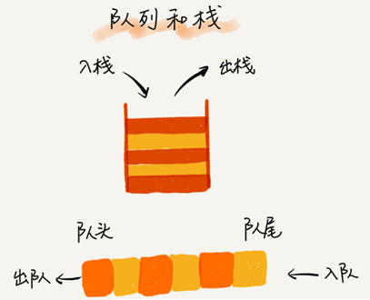
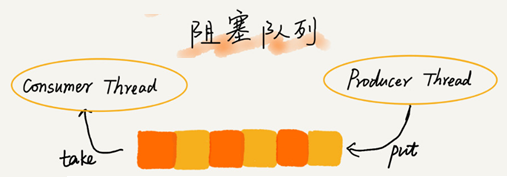
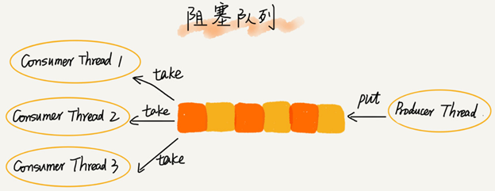

# 队列

队列最大的特点就是先进先出，主要的两个操作是入队和出队。跟栈一样，它既可以用数组来实现，也可以用链表来实现。用数组实现的叫顺序队列，用链表实现的叫链式队列。

## 工程应用

### 阻塞队列

阻塞队列其实就是在队列基础上增加了阻塞操作。简单来说，就是在队列为空的时候，从队头取数据会被阻塞。因为此时还没有数据可取，直到队列中有了数据才能返回；如果队列已经满了，那么插入数据的操作就会被阻塞，直到队列中有空闲位置后再插入数据，然后再返回。

使用阻塞队列，就可以轻松实现一个“生产者 - 消费者模型”。这种基于阻塞队列实现的“生产者 - 消费者模型”，可以有效地协调生产和消费的速度。还可以通过协调“生产者”和“消费者”的个数，来提高数据的处理效率。

###  并发队列

在多线程情况下，会有多个线程同时操作队列，这个时候就会存在线程安全问题。

线程安全的队列叫作并发队列。最简单直接的实现方式是直接在 enqueue()、dequeue() 方法上加锁，但是锁粒度大并发度会比较低，同一时刻仅允许一个存或者取操作。实际上，基于数组的循环队列，利用 CAS 原子操作，可以实现非常高效的并发队列。这也是循环队列比链式队列应用更加广泛的原因。

###  有限资源池

常见的有限资源池有线程池和数据库连接池。

当我们向固定大小的线程池中请求一个线程时，如果线程池中没有空闲资源了，这个时候线程池如何处理一般有两种处理策略：

- 非阻塞的处理方式，直接拒绝任务请求
- 阻塞的处理方式，将请求排队，等到有空闲线程时，取出排队的请求继续处理

对于大部分资源有限的场景，当没有空闲资源时，基本上都可以通过“队列”这种数据结构来实现请求排队。

